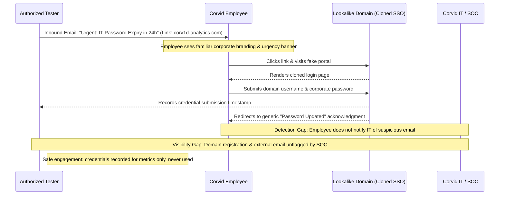

## Definition

Phishing is a deceptive message (an email, a text, a chat message) that impersonates a trusted
sender in order to trick the recipient into doing something harmful: entering credentials on a fake
page, clicking a malicious link, opening a malicious attachment, or approving a request they
otherwise wouldn't. It's the single most common way attackers get their first foothold inside an
organization, precisely because it doesn't attack a system at all. It attacks a person's judgment,
under conditions engineered to make that judgment worse than usual.

## What Makes It Work

Email, SMS, and most chat protocols were never designed to guarantee that a message's claimed sender
is its real sender. A "From" name and address are, in the plainest technical sense, just text fields
the sender's software fills in. Nothing about the underlying protocol stops someone from typing in
whatever name and address they want. Some real authentication does exist at the infrastructure level
(covered below), but the *human-visible* signal, the name and logo in an inbox, carries none of it
by default. People learn to trust that visible signal anyway, because in ordinary daily use it's
almost always accurate. Phishing exploits the gap between "usually accurate" and "cryptographically
verified."

The second thing it exploits is more purely psychological: urgency and authority reliably override
careful verification. "Your account will be locked in 24 hours," "the CFO needs this approved before
end of day," "your package couldn't be delivered": each framing is designed to make the recipient
act before they'd normally stop to check. What breaks, in security terms, is authenticity: the
recipient can no longer trust that the message is actually from who it claims to be from. Everything
downstream, including credential theft, malware execution, and fraudulent approval, depends on that
first, narrower failure.

## Where It Actually Shows Up

- **Mass, generic phishing**: the same message sent to thousands of addresses, relying on volume
  rather than precision. Low individual success rate, but cheap enough that even a fraction of a
  percent clicking through is worthwhile to the attacker.
- **Targeted phishing** aimed at a specific person or role, often impersonating an executive or
  known vendor, is covered in full on its own page, [Business Email
  Compromise](../business-email-compromise/), because the mechanics and stakes differ enough
  to deserve separate treatment.
- **Common lures**: a password-reset notice, an invoice or shared-document link, an "IT helpdesk"
  message asking to verify credentials, a delivery-failure notice.
- **Delivery channels beyond email**: SMS-based phishing ("smishing") and phishing conducted through
  workplace chat tools, both of which bypass email-specific filtering entirely.

## Why It Keeps Succeeding

Security awareness training reduces click-through rates; it does not get them to zero, and treating
"trained staff" as a complete defense misunderstands what training can realistically do. Attention is
finite, message volume is high, and a single successful click among thousands of employees is enough
to succeed. The attacker only needs to win once. Message quality has also improved substantially:
tools that generate fluent, context-appropriate text have removed the spelling and grammar mistakes
that used to be a reliable tell, closing off one of the easiest detection heuristics people relied on
for years.

## How to Detect It

- **Sender domain mismatch**: the displayed name looks right, but the actual sending domain doesn't
  match the organization it claims to represent. This is the single highest-value thing to teach
  people to check, because it's the hardest part of the impersonation for an attacker to fake
  convincingly.
- **Urgency plus an unusual request, together**: either alone is common in legitimate mail; the
  combination is the actual signal worth acting on.
- **Hovering over (not clicking) a link** to see its real destination before deciding anything.
- **Email authentication technologies**: SPF, DKIM, and DMARC are protocol-level mechanisms that let
  a receiving mail server verify whether a message claiming to be from a given domain was actually
  authorized to be sent from there. They don't stop a convincing message from a lookalike domain, but
  they meaningfully reduce direct impersonation of a domain the organization actually owns.
- **A reporting culture**: a one-click "report phishing" button used without embarrassment is a
  detection mechanism in its own right, surfacing a live campaign while it's still active instead of
  only after someone's already been compromised.

## Impact by Scenario

| Scenario | Realistic impact |
|---|---|
| Recipient clicked a link but entered no data | Confirms the message reached and was opened; minimal direct impact if no further action was taken |
| Recipient entered credentials on a fake login page, account has no MFA | Full account takeover: the credential alone is sufficient for the attacker to log in as the victim |
| Recipient entered credentials, account is protected by MFA | Credential is compromised but insufficient alone; impact depends on whether the attacker also has a path to the second factor (a real, non-trivial risk with SMS-based MFA specifically) |
| Compromised account has access to shared financial or HR systems | Initial foothold escalates directly into a much more serious incident: exactly the scenario [Business Email Compromise](../business-email-compromise/) covers in detail |

## Why a Business Should Care

Phishing is consistently one of the most common starting points for a serious security incident, not
because it's technically sophisticated, but because it's cheap, scalable, and targets the one part of
any system that can't be patched: human attention under time pressure. The honest way to frame
defensive spending here to a client is realistic, not absolute: no training program, no email filter,
drives the click-through rate to zero. What a well-run program actually buys is a lower rate, faster
detection when it does happen, and, critically, controls further down the chain (MFA, monitoring,
fast credential rotation) that limit how much damage one successful phish can do. A client who expects
"we trained everyone, so this can't happen to us" is being set up for a bad surprise; a client who
understands phishing as an ongoing, never-fully-solved risk they're actively managing is in a much
stronger position.

## A Worked Example

*(Generalized from real engagement patterns. Company, product, and identifiers below are invented;
no real system, client, or data is referenced.)*

As part of an authorized social engineering assessment, a testing team sends a small group of
employees at Corvid Analytics a message that appears to come from the company's IT department,
warning that their password will expire within 24 hours and providing a link to "renew" it. The link
leads to a page visually identical to the company's real single sign-on portal, hosted on a domain
one character off from the real one.

Three employees enter their credentials on the fake page before the campaign is halted per the
engagement's agreed rules of engagement. None of the captured credentials are used to log into any
real system: the assessment's goal is to measure susceptibility and response, not to cause an
actual account compromise. The finding that matters most isn't the three clicks; it's that none of
the three employees reported the message, and IT's own monitoring never flagged the lookalike domain
being registered days earlier. That combination (no user reporting, no infrastructure-level
detection) is the real gap the report highlights, because it means a real attacker's identical
campaign would likely have gone unnoticed entirely.

## Severity Calibration

This class of finding typically rates **High** rather than automatically Critical, and the difference
comes down to demonstrated downstream impact, not the click itself. A phishing susceptibility finding
where captured credentials had no path to anything sensitive, and where MFA would have stopped
account takeover regardless, rates meaningfully lower than one where the compromised account had
standing access to financial systems or sensitive data with no second factor in the way. The technique
is the same either time; the blast radius it actually reaches is what changes the rating.

## Prevention & Response

The real fix is layered: multi-factor authentication so a captured password alone isn't sufficient,
SPF/DKIM/DMARC to reduce direct domain impersonation, a reporting culture that surfaces active
campaigns quickly, and a fast, practiced credential-rotation process for when a click does happen.
None of these alone is sufficient; together, they shrink both the likelihood of a successful phish and
the damage one causes when it inevitably still happens.

The common inadequate response is an annual training video treated as a compliance checkbox, with no
simulated phishing follow-through and no measurement of whether it actually changed behavior. Training
that isn't tested is a hope, not a control.

## Related Attacks & Vulnerabilities

- [Business Email Compromise](../business-email-compromise/): the targeted, researched variant of
  this same technique, usually aimed at financial fraud rather than broad credential harvesting.
- [Social Engineering](../social-engineering/): the broader category of manipulating a person rather
  than a system, of which phishing is the email-and-message-based form.
- [Credential Stuffing](../credential-stuffing/): a different technique that often benefits from
  credentials phishing has already harvested, once they leak or get reused elsewhere.
