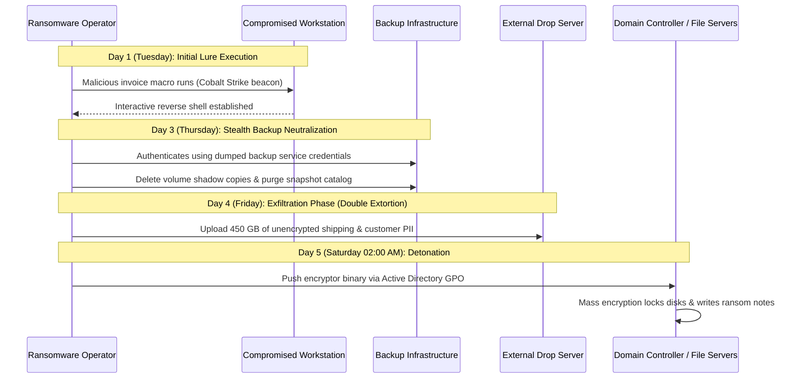

## Definition

Ransomware is malware that encrypts an organization's files and demands payment, usually in
cryptocurrency, for the decryption key needed to recover them. It's a specific, extortion-shaped
subtype of the broader [malware](../malware/) category, defined not by how it gets in but by what it
does once it's there: it doesn't quietly steal data in the background, it deliberately announces
itself by taking something the victim needs and holding it for ransom.

Modern ransomware has also evolved past pure encryption. Most serious incidents today follow a
"double extortion" model: the attacker copies sensitive data out of the environment *before*
encrypting anything, so even an organization with perfect backups still faces a second threat
(public release or sale of the stolen data) that a clean restore does nothing to solve. Treating
ransomware as "the encryption problem" alone is exactly the outdated framing that leads to incomplete
incident response.

## What Makes It Work

Ransomware exploits a simple, mostly correct assumption: that an organization can always recover from
disaster by restoring from a backup. What makes ransomware effective is a deliberate, targeted attack
on that specific assumption: before encrypting production data, a competent ransomware operator
searches for and disables or deletes backup systems first, precisely to remove the "just restore"
option and make payment feel like the only path back to operation.

The security property that breaks first is **availability**: files, systems, and often entire
business processes stop working. Under the double-extortion model, **confidentiality** breaks too,
the moment data is exfiltrated before encryption ever starts. What almost never breaks, notably, is
the attacker's own technical sophistication requirement: modern ransomware-as-a-service kits mean the
person deploying the attack often didn't write any of the code themselves.

## Where It Actually Shows Up

- **Phishing** as the most common initial access vector, followed closely by exposed remote-access
  services (RDP left open to the internet with weak credentials) and unpatched public-facing
  vulnerabilities.
- **Healthcare, manufacturing, and municipal government** are disproportionately common real-world
  targets, not because they're technically weaker across the board, but because downtime in these
  sectors is unusually costly and time-sensitive, which increases the pressure to pay quickly.
- **Backup infrastructure sitting on the same network segment** as the production systems it's meant
  to protect, meaning a single lateral-movement path can reach both.
- **Ransomware-as-a-service**: affiliate programs where the group that develops the ransomware isn't
  the same group that deploys it, splitting the ransom with whoever gained initial access. This
  structure is why the technical bar for launching a serious ransomware attack has dropped over time.

## Why It Keeps Succeeding

Organizations frequently discover that their backups exist on paper but were never tested through an
actual full restoration. Only at the moment of a real incident do they learn a backup job silently
failed months ago, or that "backed up" only ever covered a subset of what actually matters to restore
operations. Ransomware operators also specifically hunt for and disable backup and shadow-copy
services as a standard, well-established step in their playbook, precisely because it's such a
reliable way to remove the option that would otherwise make paying unnecessary.

## How to Detect It

The ransom note is the *last* signal, not the first: by the time it appears, encryption is typically
already complete. Earlier, more useful indicators include:

1. **Unusual mass file activity**: a burst of file renames or modifications across many directories
   in a short window, well outside a user's normal behavior.
2. **Backup or shadow-copy service tampering**: backup jobs failing unexpectedly, shadow copies being
   deleted, or backup agent services being stopped.
3. **Security tool tampering**: endpoint protection or logging agents being disabled or uninstalled,
   often one of the last steps before encryption begins.
4. **Lateral movement patterns** that don't match a legitimate administrative task: an account
   authenticating to an unusual number of systems in a short period.

## Impact by Scenario

| Scenario | Realistic impact |
|---|---|
| Data encrypted, backups intact and genuinely restorable | Operational downtime during restoration, but no ransom payment required and no confirmed data exposure |
| Data encrypted, backups also disabled or destroyed | Full dependency on either paying (with no guarantee of a working decryption key) or rebuilding from scratch |
| Double extortion: data exfiltrated before encryption | Downtime plus a separate, ongoing extortion and potential regulatory-notification exposure, regardless of whether backups worked |
| Ransomware contained to a single, isolated segment before lateral movement completed | Limited blast radius: the scenario a well-segmented network is specifically designed to produce |

## Why a Business Should Care

The honest total cost of a ransomware incident is rarely just the ransom demand. It's the operational
downtime, the incident response and forensic investigation, the cost of rebuilding trust with
customers and partners, and, if data was exfiltrated, the regulatory notification obligations that
follow. Paying the ransom doesn't reliably solve any of these: a decryption key from a criminal
organization isn't guaranteed to work cleanly, and paying to prevent data release doesn't guarantee
the data won't be leaked or resold anyway. The responsible way to frame this with a client is that
paying is, at best, a partial and uncertain mitigation for one part of the problem, not a clean
solution, which is exactly why prevention and tested recovery matter more than the ransom
negotiation ever will.

## A Worked Example

*(Fully invented for illustration; no real organization, incident, or data referenced.)*

Ferro Logistics, a mid-sized freight company, has an employee open a convincing invoice-themed
phishing attachment. The resulting foothold is used over the next several days to move laterally
across the internal network, eventually reaching the file server hosting the company's backup
software console. The attacker disables the nightly backup job and deletes the most recent backup
snapshots, then spends roughly six hours copying a subset of shipping and customer contract data to
an external server before triggering encryption across every file server and several employee
workstations simultaneously, timed for early Saturday morning to maximize the window before anyone
notices.

Monday morning, IT discovers systems are unusable and a ransom note references the stolen data
directly, confirming the double-extortion pattern. Because the backup deletion happened days earlier,
Ferro's IT team initially believes their most recent backup is intact and only discovers otherwise
once they attempt an actual restore. The exact gap a tested restoration drill, run in advance, would
have caught before it mattered.

## Severity Calibration

This scenario rates **Critical**: production systems across multiple business functions were
encrypted, backups were deliberately compromised removing the clean recovery path, and confirmed data
exfiltration adds a regulatory-notification obligation on top of the operational outage. Notice what's
actually driving that rating: it's the combination of backup compromise and confirmed exfiltration,
not the mere fact that "ransomware" is the attack type. A ransomware incident caught and contained
before lateral movement reached backup infrastructure, with a clean, verified restore available, would
rate meaningfully lower: the technique's name doesn't set the severity; the demonstrated blast radius
does.

## Prevention & Response

The real fix is layered: offline or immutable backups (backups the ransomware itself cannot reach or
modify even with full network access) that are actually tested through real restoration drills on a
regular schedule, network segmentation that keeps backup infrastructure isolated from general user and
server segments, prompt patching of internet-facing systems, and endpoint detection tuned to catch the
early indicators listed above rather than only the final encryption event.

The common inadequate fix is having backups that exist and are never tested, or backups that are
technically "separate" but reachable from the same credentials and network path as production
systems, which is functionally the same as not having a separate backup at all, from the attacker's
perspective.

## Related Attacks & Vulnerabilities

- [Malware](../malware/): the broader category ransomware belongs to; this page assumes that
  general context rather than repeating it.
- [Insider Threat](../insider-threat/): a small share of ransomware incidents involve an insider
  providing or selling initial access rather than a purely external attacker.
- [Advanced Persistent Threat](../advanced-persistent-threat/): some ransomware operators behave with
  APT-like patience, spending extended time on reconnaissance and lateral movement before triggering
  encryption, rather than acting immediately after initial access.
