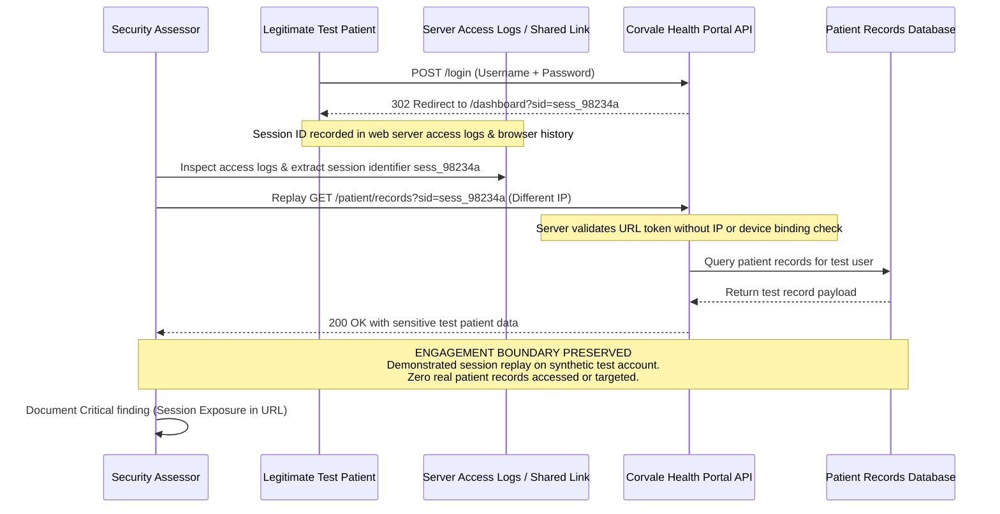

## Definition

Identification and authentication failures are weaknesses in the process of proving who someone is,
as distinct from broken access control, which is about what an already-identified user is allowed to
do. This class covers the login form, the password reset flow, the session token issued after a
successful login, and every account-recovery path, since a single weak link in any of those breaks
the whole chain of trust the rest of the application depends on.

## The Trust Boundary That Breaks

The assumption most applications make is that a successful login is a strong, durable proof of
identity for the entire session that follows. That assumption only holds if every part of the
authentication process is protected equally: the credentials themselves, the session token issued
afterward, and the recovery paths that exist for when a legitimate user loses access. In practice,
teams often harden the login form carefully (password rules, lockouts) while leaving the token that
represents a successful login, or the recovery flow that bypasses it entirely, far less protected.

## Where It Actually Shows Up

- No multi-factor authentication available or enforced, leaving a password as the single point of
  failure for account access.
- Session identifiers passed as URL parameters rather than in cookies, which means they get logged
  and cached in browser history, proxy logs, and server access logs by default.
- Predictable or non-expiring session tokens, including session fixation, where an attacker can set a
  known session identifier for a victim ahead of time.
- Weak or absent account lockout on login endpoints, which is exactly the design gap that lets
  [brute force](../../attacks/brute-force/) and [credential stuffing](../../attacks/credential-stuffing/)
  attacks run unthrottled at scale.
- Password recovery flows that reveal whether a given email address has a registered account, or that
  rely on a weak secondary verification step easily answered from public information.

## Why It Keeps Happening

Teams frequently put real effort into hardening the login form itself: complexity rules, rate
limiting, sometimes MFA, while treating everything that happens after a successful login as a solved
problem. The session token that represents that login, and the recovery flow that exists for when a
user forgets their password entirely, often get far less scrutiny, precisely because they don't feel
like "the authentication step" even though they're functionally just as capable of granting access.

## How to Find It

1. Check whether session identifiers ever appear in a URL rather than exclusively in a cookie; if
   they do, they're already exposed to logging and caching by default.
2. Test whether an account lockout or rate limit actually triggers under a real, controlled attempt,
   rather than assuming it works because it's documented as a feature.
3. Attempt to set a known session identifier before a victim logs in, then check whether that same
   identifier remains valid and authenticated afterward, which would confirm session fixation.
4. Test the password recovery flow specifically for information leakage: does it respond differently
   for a registered email versus an unregistered one, and how strong is any secondary verification
   step it relies on.

## Impact by Scenario

| Scenario | Realistic impact |
|---|---|
| MFA enforced, session tokens only in secure cookies, lockout confirmed working | Attack surface for this class is largely closed even if a password is individually weak |
| No MFA, but strong lockout and secure session handling | Reduced but real risk, mainly from credential stuffing against reused passwords elsewhere |
| Session identifier exposed via URL, no MFA | Full account takeover possible for anyone who obtains a logged or cached URL, no password needed |
| Recovery flow leaks account existence and uses weak secondary verification | Account takeover path that bypasses the primary login and its protections entirely |

## Why a Business Should Care

This class is where "we have a strong login page" can create false confidence, because the login
form is rarely the actual weakest point once it's had real attention. The parts of authentication
that get skipped, session handling and recovery flows especially, are just as capable of granting
full account access, and a client who only asks about password strength is asking the wrong question.
The right framing for a client conversation: authentication is the whole chain, not just the door.

## A Worked Example

*(Generalized from real assessment patterns. Company and identifiers below are invented; no real
system, client, or data is referenced.)*

Corvale Health's patient portal issues a session identifier that is included directly in the URL
after login, rather than set as a cookie. During testing, this identifier is found in the web
server's own access logs and, separately, in a colleague's browser history after a portal link was
shared over an internal chat tool, confirming the exposure happens through completely ordinary,
everyday use rather than requiring any active interception.

Using a captured identifier from the access logs, the tester confirms it remains valid and
authenticated when replayed from a different device and network, demonstrating that anyone who
obtains a logged URL, through any of the normal channels URLs travel through, can impersonate that
user without ever needing their password.

Testing stops at confirming replay works against a test account created specifically for this
assessment. No real patient session is ever captured or reused, and no actual patient data is
accessed, since proving the mechanism is sufficient without touching anything real.

## Severity Calibration

This instance rates **Critical**: unauthenticated in the sense that no password is required once a
session identifier is obtained, realistically exploitable through completely ordinary log and browser
history exposure rather than a contrived scenario, and demonstrated against a real patient portal
handling health data specifically, which raises both the practical impact and the regulatory stakes.
The same design flaw on an application with no sensitive data behind it would rate lower.

## Remediation

The real fix is enforcing MFA wherever the sensitivity of the account justifies it, issuing session
tokens exclusively through secure, HttpOnly cookies rather than URLs, implementing account lockout or
exponential backoff on every authentication endpoint, and building recovery flows that don't reveal
whether an account exists and don't rely on weak secondary verification.

The common bad fix is relying on password complexity requirements alone while leaving session
handling and recovery flows unexamined, as if a strong password policy compensates for a session
token that was never actually protected after issuance.

## Related Classes

- **[Broken Access Control](../broken-access-control/)**, the closely related but distinct class
  covering what an authenticated user is allowed to do, as opposed to how that authentication
  happened in the first place.
- **[Cryptographic Failures](../cryptographic-failures/)**, a closely adjacent class worth checking
  as a pair: weak login and session handling here, weak password hashing there, since a real
  assessment frequently finds both on the same application.
- **[Session Hijacking](../../attacks/session-hijacking/)**, the attack technique that directly exploits many of the weaknesses described
  here.
