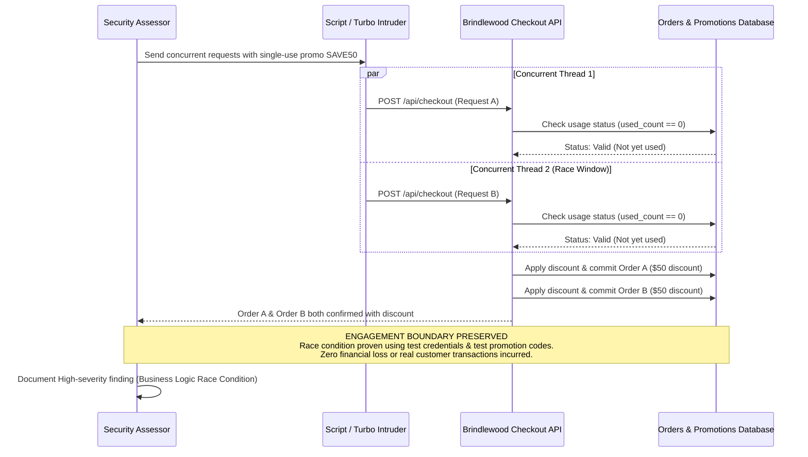

## Definition

A business logic vulnerability is a flaw in how a feature's business rules are actually
implemented, exploitable by using the feature exactly as built, but in a sequence, combination, or
context nobody designing it accounted for. There is no malformed input and no coding mistake in the
usual sense; every individual request is perfectly valid. The problem is in the workflow the
requests are used to construct.

A note on the `cwe` field above: it is intentionally empty. This class describes a flaw in
implemented workflow logic, not one specific technical weakness pattern, so there is no single
narrow CWE identifier that fits it the way there is for something like SQL injection. Leaving it
blank follows the same rule this site applies everywhere: cite an identifier only when one is
genuinely known, never invent one to look more authoritative.

## The Trust Boundary That Breaks

Distinguish this clearly from [Insecure Design](../insecure-design/), which it sits closest to.
Insecure Design is a missing security control at the architecture level, decided before anything was
built. A business logic vulnerability is a flaw within a specific feature's already-implemented
workflow, and it can exist even in a system that is otherwise well-designed and threat-modeled,
simply because one particular abuse sequence was never anticipated. The trust boundary that breaks
is the assumption that a workflow's steps will only ever be exercised in the order, frequency, and
combination the design intended, when nothing about a web request actually enforces that order.

## Where It Actually Shows Up

- **Discount or promotion abuse**: applying a single-use code multiple times by exploiting a timing
  window between when a code's usage is checked and when it is actually recorded as used.
- **Negative-value manipulation**: a shopping cart or quantity field that accepts a negative number,
  turning a purchase into a refund the system never intended to allow.
- **Workflow-step skipping**: a multi-step process (identity verification before a high-value
  action, for example) bypassed by calling a later step's API endpoint directly instead of
  progressing through the intended sequence in the user interface.
- **Rate-limit reset abuse**: a password-reset or verification flow whose attempt counter resets
  under a specific, unintended condition, effectively removing the limit the design assumed was
  in place.

## Why It Keeps Happening

Automated scanners cannot find this class of flaw, because there is no malformed input and no
broken syntax to detect. The request is well-formed and the response is exactly what the endpoint is
supposed to return; the flaw only exists in the sequence or combination of otherwise-valid requests.
That means only a person deliberately thinking through the feature's actual business rules, and
deliberately trying to break them, will ever find it. Teams under deadline pressure also tend to
threat-model the code they are writing, not the business process the code is meant to enforce, which
is exactly where this gap lives.

## How to Find It

1. Map out the complete intended workflow for a feature, step by step, exactly as a legitimate user
   is meant to experience it.
2. Deliberately test out-of-order execution: call a later step's endpoint directly without
   completing the steps that are supposed to precede it.
3. Deliberately test repeated execution of anything meant to happen once, and concurrent execution
   of anything meant to happen sequentially, as a timing-based race condition test.
4. Test boundary and negative values on any numeric field a legitimate user would never normally
   need to set outside an expected range (quantity, amount, count).
5. Treat every finding as a hypothesis about the underlying business rule, not just the specific
   value that happened to work, and confirm the same gap holds across a couple of variations before
   reporting it as a real, repeatable flaw rather than a one-off anomaly.

## Impact by Scenario

| Scenario | Realistic impact |
|---|---|
| A minor workflow quirk with no measurable financial or data impact | Low; worth fixing, but not a serious business risk on its own |
| A discount-stacking or promotion-abuse flaw with a bounded per-use financial impact | Direct financial loss, scaled by how automatable the repeated abuse is |
| A flaw enabling unlimited repeated exploitation of a limited-use resource (a one-time code, a rate-limited action) | Loss that scales with automation; a manual one-off abuse becomes a scripted, large-scale one |
| A skipped verification step in a high-value workflow (payment, identity confirmation) | Direct compromise of the control the skipped step existed to provide |

## Why a Business Should Care

Business logic vulnerabilities are the class of finding a client is most likely to dismiss as "an
edge case" right up until it is demonstrated with a real number attached, at which point it becomes
obviously serious. The useful framing for a client is that no scanning tool, no matter how
comprehensive, will ever catch this category on its own, because there is nothing technically wrong
with any individual request. Coverage here depends entirely on someone deliberately thinking through
how the feature's own rules could be broken, which is exactly the kind of testing a human tester
provides that automated tooling structurally cannot.

## A Worked Example

*(Generalized from real assessment patterns. Company and identifiers below are invented; no real
client, system, or data is referenced.)*

Brindlewood Media's checkout flow applies a single-use promotional code by first checking the code's
current usage count, then, in a separate step, incrementing that count once the order is confirmed.
During an authorized assessment, submitting two checkout requests carrying the same code within a
fraction of a second of each other, using a test account and test payment credentials, results in
both orders receiving the discount. Each request independently read the code's usage count before
either request's increment had been recorded, so both saw the code as "not yet used."

The flaw is confirmed by repeating the test a small number of additional times with the same tight
timing, consistently reproducing the double-application rather than treating the first result as a
fluke. No real customer promotional codes or real payment transactions are involved at any point;
every test purchase uses test-only credentials specifically provisioned for the assessment.

## Severity Calibration

This instance rates **High**: reliably reproducible, directly resulting in unintended financial
loss per exploitation, and realistically automatable at scale by scripting the same timing window
against many codes or many attempts. A version of the same flaw affecting a code worth a
trivial, fixed discount with a hard cap on total redemptions would rate lower, since the bounded
total loss limits the real-world impact regardless of how reliably the timing window can be
triggered.

## Remediation

The real fix is explicit, atomic server-side state validation at every step of a workflow: checking
and recording a code's usage in a single atomic operation rather than as two separate steps with a
gap between them, and treating concurrency and race conditions as a first-class design concern
anywhere money or a limited-use resource is involved. Every workflow step that depends on "this
has not happened yet" needs to make that check and that state change indivisible.

The common bad fix is relying on client-side validation or user-interface restrictions alone,
disabling a button after one click, for instance, which does nothing to stop a request sent directly
to the underlying API rather than through the intended interface.

## Related Classes

- **[Insecure Design](../insecure-design/)**: the broader architecture-level category this class sits closest to; see it
  for design-phase gaps that exist even before a specific workflow abuse is demonstrated.
