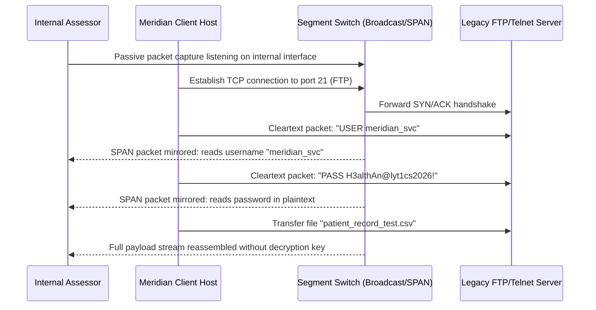

## Definition

This class covers network services still communicating over unencrypted, cleartext protocols,
legacy remote administration tools, unencrypted file transfer, plaintext directory or management
protocols, in an environment where encrypted alternatives have long been standard. Anyone positioned
to observe traffic on the network path between the client and the service, whether through a
compromised device on the same segment, a rogue wireless access point, or a position gained through
another finding entirely, can read everything that traffic contains, in full, exactly as it was sent.

## The Trust Boundary That Breaks

Encryption in transit exists specifically because a network path can't be assumed private by default:
switches can be misconfigured, wireless traffic can be intercepted, and an attacker who has gained any
foothold on the network can often observe far more traffic than the environment's own design assumed
they could. Services still running unencrypted protocols were frequently built or deployed at a time
when internal network traffic was treated as implicitly trusted, an assumption that has not held up
well as networks have grown more complex, more segmented in practice than in theory, and more exposed
to devices of uncertain trustworthiness.

## Where It Actually Shows Up

- Legacy remote administration protocols that transmit login credentials and full session content
  without encryption, still reachable somewhere in the environment for compatibility with an older
  system.
- Unencrypted file transfer protocols still in use for internal or even external file exchange,
  transmitting file contents and often credentials in plaintext.
- Internal management or monitoring protocols carrying device configuration data, including
  credentials, in cleartext, on the assumption that "it's only used internally" is itself a sufficient
  protection.
- Email protocols configured to accept unencrypted connections as a fallback, transmitting message
  content and authentication credentials in the clear whenever a client happens to connect that way.
- Internal APIs or services communicating over plain HTTP within a network the organization
  considers trusted, carrying the same sensitive data an external-facing service would properly
  encrypt.

## Why It Keeps Happening

Unencrypted legacy protocols persist because migrating away from them requires touching every client
and system that depends on them, and because the risk feels abstract on a network segment nobody
expects to be compromised. "It's internal, not internet-facing" is a common, comfortable justification
that ignores how frequently lateral movement, following an initial compromise elsewhere, is exactly how
an attacker ends up positioned to observe internal traffic in the first place. The service keeps
working correctly the entire time, which removes any natural pressure to revisit the decision.

## How to Find It

1. Scan the environment for services responding on ports associated with known unencrypted protocols,
   and confirm directly whether the encrypted alternative is available and actually enforced instead.
2. Where authorized, capture traffic to a service suspected of using an unencrypted protocol and
   confirm whether credentials or sensitive data are visible in plaintext within that capture.
3. Review whether any service accepts an unencrypted connection as a fallback when a client doesn't
   request encryption, rather than rejecting the unencrypted attempt outright.
4. Prioritize testing services carrying authentication credentials or sensitive business data first,
   since the realistic impact of this class depends heavily on what the specific protocol actually
   transmits.

## Impact by Scenario

| Scenario | Realistic impact |
|---|---|
| Unencrypted protocol carries only non-sensitive, already-public data | Low; limited real exposure |
| Unencrypted protocol carries internal configuration data with no direct credential exposure | Medium; a real information-disclosure risk |
| Unencrypted protocol transmits authentication credentials in plaintext | Critical; direct credential exposure to anyone on the network path |
| Unencrypted protocol carries sensitive business or customer data at meaningful volume | Critical; a large-scale data exposure to anyone positioned to intercept it |

## Why a Business Should Care

The business risk here compounds with how much lateral movement matters elsewhere in the environment:
even a network segmented reasonably well can still have an attacker land somewhere with visibility
into unencrypted traffic, and every credential or piece of sensitive data transmitted in cleartext from
that point forward is available to them with no further technique required. This is a genuinely
low-cost fix relative to its risk reduction in most environments, since encrypted alternatives to
virtually every legacy cleartext protocol already exist and are typically a configuration change away,
which makes it a good, low-friction item to prioritize early in a remediation roadmap.

## A Worked Example

*(Generalized from real assessment patterns. Company and identifiers below are invented; no real
system or data is referenced.)*

During an internal network assessment for Meridian Health Analytics, network traffic capture,
performed with explicit written authorization from a position on the internal network, reveals a
legacy file-transfer service still accepting unencrypted connections. A test file transfer, performed
using credentials created specifically for this assessment, confirms both the login credentials and
the file's contents are fully visible in plaintext within the captured traffic.

Testing is limited to a test account and test file created for this assessment. No real user's
credentials or file content are captured or reviewed at any point.

## Severity Calibration

This rates **Critical** because the confirmed cleartext exposure includes live authentication
credentials, meaning anyone positioned on the same network path can capture and reuse them directly,
with no further technique required. The identical unencrypted protocol carrying only non-sensitive,
already-public configuration data would rate substantially lower: severity tracks what the specific
protocol actually transmits in the clear, not the mere use of an unencrypted protocol in the abstract.

## Remediation

The real fix is migrating every service still using an unencrypted protocol to its modern, encrypted
equivalent, and disabling the unencrypted fallback entirely rather than leaving it available for
backward compatibility. Where a legacy system genuinely cannot support encryption, isolating it on a
tightly restricted network segment reduces, though doesn't eliminate, the exposure until it can be
replaced.

The common bad fix is treating "it's an internal-only network" as sufficient justification to leave a
cleartext protocol in place indefinitely. Internal network trust is exactly the assumption [Network
Segmentation Failures](../network-segmentation-failures/) and [Weak or Missing Network Access
Controls](../weak-network-access-controls/) exist to show doesn't reliably hold in practice.

## Related Classes

- **[Weak or Missing Network Access Controls](../weak-network-access-controls/)**:
  a frequently co-occurring gap, since an overly permissive access rule often exposes a cleartext
  legacy service that a properly scoped rule would have kept unreachable.
- **[Network Segmentation Failures](../network-segmentation-failures/)**:
  the broader assumption this class directly undermines, that internal network traffic can be treated
  as implicitly trusted and therefore safe to leave unencrypted.
