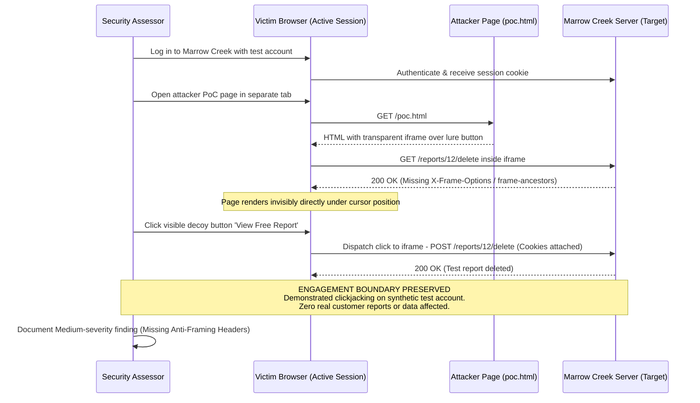

## Definition

Clickjacking is an attack that loads a legitimate page inside an invisible or visually disguised
frame on an attacker-controlled site, then overlays deceptive content on top of it. The victim sees
a fake button, image, or prompt and clicks it, believing they're interacting with the attacker's
page. In reality, the click lands on the hidden legitimate page underneath, triggering whatever
action sits at that exact pixel: a "delete account" button, a "confirm transfer" prompt, a "grant
access" authorization screen.

## The Trust Boundary That Breaks

The legitimate site trusts that a click arriving at it came from a user who intentionally navigated
there and could see the real interface in front of them. Framing breaks that assumption completely.
The user never saw the real page at all. They saw whatever the attacker chose to display on top of
it, and clicked based on that fake content, with no way to know a hidden, fully functional page sat
underneath their cursor the entire time.

## Where It Actually Shows Up

- Single-click, state-changing actions: a one-click "delete," "like," "follow," or "confirm" button
  that requires no further confirmation step.
- Login or authorization buttons framed under a disguised overlay, such as an OAuth "authorize this
  app" prompt hidden beneath a fake "watch video" button.
- Any page that doesn't explicitly control whether it can be embedded in another site's frame at
  all. Absence of that control, not presence of a specific flaw, is what makes framing possible.
- Payment or account-setting confirmation screens reachable in a single click, with no secondary
  verification step.

## Why It Keeps Happening

Framing protection has to be explicitly configured through a response header. It isn't a browser
default the way some other protections are, so a page built without a security-focused review
checklist is frameable by default, simply because nobody set the header rather than because
anything was coded incorrectly. Teams also frequently assume that because a page requires a login
to reach, framing "doesn't matter," missing that a victim who is already logged in in one browser
tab is exactly the target this attack is built for.

## How to Find It

1. Attempt to embed the target page inside a test iframe on a page you control, and check whether
   it renders normally rather than being blocked or refusing to display.
2. Inspect response headers directly for the presence or absence of frame-control headers, rather
   than relying only on whether the browser visually blocked the frame in one test case.
3. If framing succeeds, identify every single-click, state-changing action reachable on that page
   and treat each one as its own separate finding, since the impact differs sharply by action.
4. Confirm whether a Content-Security-Policy is present and, if so, whether its `frame-ancestors`
   directive actually restricts framing, since a policy that covers other protections but omits
   this directive still leaves the page frameable.

## Impact by Scenario

| Scenario | Realistic impact |
|---|---|
| A cosmetic, single-click preference toggle is framable | Low: real but bounded annoyance, not a security-critical outcome |
| A one-click "authorize this app" or "grant permission" action is framable | High: an attacker can silently grant themselves access the victim never intended |
| A one-click payment-confirmation or destructive account action is framable | Critical: direct financial loss or irreversible account damage with a single disguised click |

## Why a Business Should Care

Clickjacking is the kind of finding that's easy to underestimate because the underlying code is
often otherwise correct. The problem isn't a coding mistake in the traditional sense, it's a missing
header, and a missing header on the wrong page can turn an ordinary one-click convenience feature
into a silent authorization or destructive-action vector. When explaining this to a client, the
useful framing is that any product decision to make an action "just one click" for convenience
directly increases how much that specific action is worth protecting against exactly this attack.

## A Worked Example

*(Generalized from real assessment patterns. Company, product, and identifiers below are invented;
no real system, client, or data is referenced.)*

During an assessment of Marrow Creek Analytics' customer dashboard, a one-click "delete this
report" button is found reachable without any confirmation dialog. Testing whether the page can be
framed on an attacker-controlled test page succeeds: the page loads normally inside the test
iframe, with no frame-control header present in the response at all.

An invisible version of that frame is positioned under a fake "view your free report" button on the
test page, aligned precisely so the fake button's visible location matches the real delete button's
actual position underneath. A disposable test account, logged in in a separate tab, is used to
confirm the click passes through: clicking the fake button on the test page deletes the report
belonging to the test account, proving the framing attack actually works end to end. No real
customer account or data is touched at any point; the entire proof is built and confirmed against a
throwaway test account created specifically for this purpose.

## Severity Calibration

This instance rates **Medium** rather than higher, because the framed action, deleting a single
report, while genuinely undesired and unauthorized if triggered, doesn't reach financial loss,
credential exposure, or irreversible account takeover on its own. The same underlying missing header
found on a payment-confirmation or account-recovery page instead would rate meaningfully higher; the
technique is identical, but severity tracks what the framed action actually does, not the presence
of the missing header by itself.

## Remediation

The real fix is setting the `X-Frame-Options` header (`DENY` or `SAMEORIGIN`, depending on whether
the page ever legitimately needs to be framed by the same site) or, for finer control, a
Content-Security-Policy `frame-ancestors` directive, which is the more flexible modern mechanism and
supports restricting framing to a specific, named list of trusted origins.

The common bad fix is relying on client-side JavaScript "frame-busting" code alone, scripts that try
to detect framing and break out of it. Several well-documented techniques exist to neutralize
frame-busting scripts from the framing page's side, so this approach is not a substitute for the
actual header-level control, only a weak, bypassable supplement to it.

## Related Classes

- **[Security Misconfiguration](../security-misconfiguration/)**,
  the broader category this class sits under: a missing header is a configuration gap, not a coding
  bug in the traditional sense.
- **[WebApp Security](../../domains/webapp-security/)**, the domain page where this header is
  discussed alongside the site's other browser-layer security headers.
