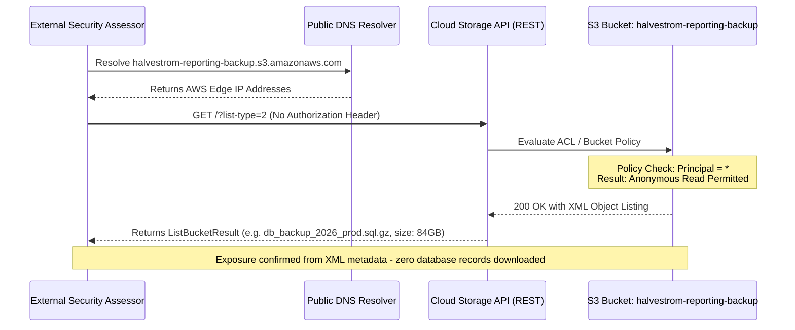

## Definition

Public cloud storage exposure happens when an object storage resource, an S3 bucket, an Azure Blob
container, a Google Cloud Storage bucket, is configured so that anyone on the internet can list,
read, or write its contents without presenting any credentials. The provider's infrastructure
underneath the bucket is not compromised in any of these cases. The access-control setting on top of
it, a setting the customer controls entirely, is simply wrong.

## The Trust Boundary That Breaks

A developer creating a storage bucket assumes that "private by default" is the safe starting point,
and that making something public is a deliberate, visible choice. That assumption doesn't hold
uniformly across providers, account histories, or infrastructure-as-code templates: a bucket can end
up public through an explicit ACL, a bucket policy with an overly broad principal (`*` or "any
authenticated user" instead of a specific identity), a "public access" account-level setting left
disabled, or an infrastructure-as-code module copied from an example that never intended to be run in
production.

The trust boundary that has to hold is the one between "this resource exists inside our environment"
and "this resource is reachable from the entire internet." A storage bucket has no network perimeter
of its own the way a server behind a firewall does: its access control *is* its perimeter, expressed
entirely as configuration rather than network topology, and a single incorrect setting removes the
entire boundary at once.

## Where It Actually Shows Up

- A bucket ACL or bucket policy granting read (and occasionally write) access to "everyone" or "any
  authenticated cloud user" (which, on most providers, means any account on that provider, not just
  the bucket owner's own users).
- An account-level "block public access" setting that exists specifically to prevent this, but was
  turned off at some point, often to work around a one-off requirement, and never turned back on.
- Static website hosting or public-asset buckets (intentionally public) sitting in the same account,
  same naming convention, as buckets that were only ever meant to hold internal data, an easy mixup
  during setup.
- Backups, database dumps, or log exports written to a bucket by an automated job, where the bucket's
  access setting was inherited from a template rather than reviewed for the sensitivity of what would
  actually land in it.
- Infrastructure-as-code modules, especially ones copied from a public example or tutorial, that
  hardcode a permissive access block because the example was written to be easy to follow, not safe
  to deploy unmodified.

## Why It Keeps Happening

Creating a storage bucket is a single API call or a few clicks, and the access-control decision is
one setting among many on that same screen, easy to accept at a default value without reading it
closely, especially under deadline pressure. Unlike a code-level vulnerability, there's no compiler
or test suite that fails when a bucket is public. It stays exactly as configured, silently, for as
long as nobody happens to check, and cloud accounts routinely accumulate buckets faster than anyone
is reviewing their settings.

## How to Find It

1. Attempt to list and read the bucket's contents directly, unauthenticated, using the provider's
   standard storage URL format for the bucket's name and region.
2. Where the bucket name isn't already known, cloud storage naming conventions are predictable
   enough (company name, product name, environment name as prefixes or suffixes) that a wordlist
   built from the target's own public naming patterns often finds buckets that were never intended to
   be discoverable, without brute-forcing anything sensitive.
3. Check both read and write access separately: a bucket that blocks public listing can sometimes
   still allow direct reads of a known object path, and a bucket allowing public writes is a distinct,
   often more severe, finding from one that only allows reads.
4. From the account-owner side (white-box), review the account-level public-access block setting and
   every bucket policy and ACL directly, rather than relying only on the provider's own security
   dashboard, since dashboards can lag behind a very recent configuration change.

## Impact by Scenario

| Scenario | Realistic impact |
|---|---|
| Public bucket contains only already-public static assets (marketing site images, public downloads) | No impact; this is not a finding |
| Public bucket contains internal, non-sensitive operational data | Low to Medium; unintended exposure, limited real consequence |
| Public bucket contains customer PII, credentials, or internal source code | Critical; a direct, unauthenticated data breach |
| Public bucket also allows unauthenticated writes | Critical; data can be tampered with or replaced, potentially including served application content |

## Why a Business Should Care

Public cloud storage exposure is one of the most common root causes behind large, publicly reported
data breaches, not because the attack is sophisticated, but because it requires none: no exploit, no
authentication bypass, just a request to a URL that should never have answered. The business cost
compounds quickly once the exposure includes customer data: notification obligations under
applicable data protection law, regulator inquiries, and reputational damage that tracks specifically
to "the data was just sitting there openly," which reads to clients and press as carelessness rather
than sophistication on the attacker's part. It is also one of the cheapest issues to prevent: a
correctly enforced account-level "block public access" setting closes this entire class of finding at
once, which makes it a very high-leverage conversation to have with a client early.

## A Worked Example

*(Generalized from real assessment patterns. Company and identifiers below are invented; no real
system or data is referenced.)*

During a cloud configuration review for Halvestrom Logistics, enumeration of storage bucket names
built from the company's own naming convention (product name plus environment suffix) turns up a
bucket named for the company's internal reporting tool, environment "backup." Requesting the bucket's
listing endpoint directly, with no credentials supplied, returns a full object listing. Several
listed objects are database export files with a naming pattern indicating recent, automated nightly
backups.

Testing stops at confirming the listing and the file names and metadata (size, last-modified
timestamp) of a small number of objects, which is sufficient to establish that the backups are
reachable and current. No backup file's contents are downloaded or opened as part of the assessment.

## Severity Calibration

This class rates **Critical** here specifically because the exposed objects were recent, automated
database backups (a strong signal of customer or operational data at scale) and no credential of any
kind was required to reach them. The identical misconfiguration on a bucket holding only public
marketing assets would not be a finding at all: severity tracks what the bucket actually contains and
whether write access is also exposed, not the presence of a public bucket in the abstract.

## Remediation

The real fix is enabling the provider's account-level public-access block as the enforced default
across the account, and granting bucket access explicitly, by specific identity and specific
permission, rather than by broad principal, with that access reviewed on a schedule rather than set
once at creation and forgotten. Automated, continuous scanning for public buckets across the account
closes the gap between when a bucket becomes public and when someone notices.

The common bad fix is a one-time manual audit that finds and closes existing public buckets without
addressing why they became public in the first place, whether that's a permissive infrastructure-as-
code template still in use, or the account-level protective setting still being off. The same mistake
reappears with the next bucket created the same way.

## Related Classes

- **[Overly Permissive Cloud IAM](../cloud-iam-misconfiguration/)**:
  a different mechanism reaching a similar outcome, unauthorized access to cloud resources, this time
  through excessive identity permissions rather than a resource-level access setting.
- **[Security Misconfiguration](../security-misconfiguration/)**: the
  broader class this falls under, an insecure default or setting left unreviewed, applied here to the
  specific, high-frequency case of cloud storage.
