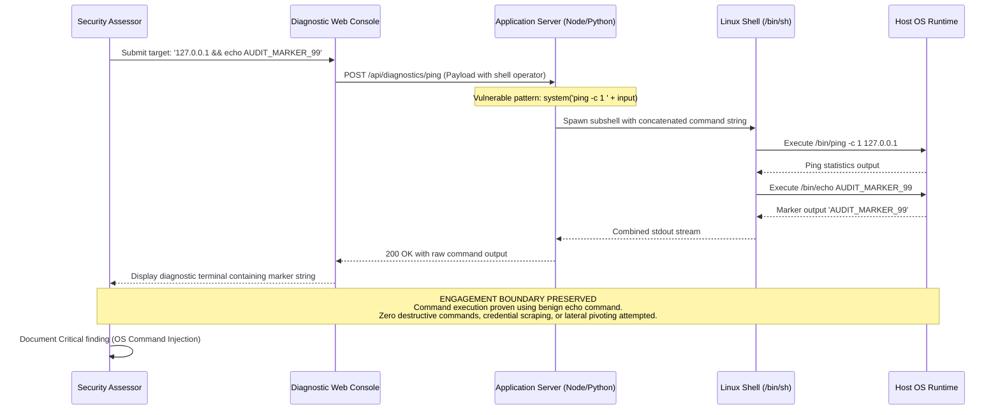

## Definition

OS command injection happens when untrusted input is passed into a function that constructs and
executes an operating-system shell command, letting an attacker append or substitute their own
commands into what the application actually runs on the underlying server. The application isn't
just handed bad data anymore. It's handed a different command to execute, at the operating system
level, not just inside the application's own logic.

## The Trust Boundary That Breaks

This is the same underlying failure already covered in depth on the [SQL Injection](../sql-injection/)
page, data crossing into code, just at a different parser. SQL injection crosses that line at the
database's SQL parser; OS command injection crosses it at the operating system's shell parser
instead. The developer trusts that a value used to build a shell command, a hostname, a filename, an
option flag, is inert text, when the shell itself treats specific characters (a semicolon, a pipe, a
backtick) as command syntax regardless of what the application intended. Once untrusted input reaches
a shell invocation without being kept strictly as a single, literal argument, that boundary is gone.

## Where It Actually Shows Up

- Diagnostic or utility features that shell out to a system tool directly, a "ping this host" or
  "check this domain" feature being a classic example.
- Image, document, or media processing pipelines that invoke external command-line tools (a converter
  or compressor) with a filename or option derived from user input.
- Any code path that uses a generic shell-execution function, one that hands a full command-line
  string to a real shell, with request-derived data concatenated into that string.
- Legacy integration code that "just calls the existing script" for convenience, bypassing whatever
  safer, parameterized interface the rest of the application otherwise uses.

## Why It Keeps Happening

Shelling out to an existing command-line tool is often the fastest way to reuse functionality that
already exists, especially under deadline pressure, and the risk is easy to overlook because the
input in question looks like ordinary data (a hostname, a filename) rather than anything that visibly
resembles code. A safe, parameterized subprocess call and an unsafe, shell-interpreted one can look
almost identical at a glance in many languages, which makes this an easy mistake to introduce without
noticing, even in a codebase that handles most other input carefully.

## How to Find It

1. Identify any feature that appears to invoke an external command or system utility, diagnostics,
   conversion, compression, or anything that shells out to do its work.
2. Supply a value containing a shell command separator followed by a harmless, clearly identifiable
   command, such as one that prints a distinctive marker string, rather than anything destructive.
3. Confirm the marker actually appears in the application's response or observable behavior, which
   proves real execution rather than just an unusual error or a parsing anomaly.
4. Test multiple separator styles and shell metacharacters, since a fix or filter addressing one
   specific character often leaves closely related ones untouched.

## Impact by Scenario

| Scenario | Realistic impact |
|---|---|
| Command executes in a tightly sandboxed, low-privilege container with no further reachable resources | Serious but bounded: confirmed code execution, limited practical reach |
| Command executes with the same privileges as the main application process | Critical: broad access to the filesystem, other services, and stored credentials |
| Command executes on a cloud instance that can reach the instance metadata service | Critical: a direct path to cloud credentials and further account-wide compromise |
| The process runs with least-privilege access and no network egress at all | Meaningfully reduces, though does not eliminate, the real-world impact of the flaw |

## Why a Business Should Care

Command injection is one of the most severe classes on this site precisely because it doesn't just
expose data, it hands an attacker the ability to run arbitrary commands with whatever privileges the
application itself has. For a client, the framing that lands best is that this is rarely "a data leak
risk," it's closer to handing an unauthenticated stranger a terminal on the server, scoped only by
however carefully the application's own runtime privileges were limited in advance. That's exactly
why least-privilege process design matters as a second line of defense, not just a nice-to-have.

## A Worked Example

*(Generalized from real assessment patterns. Company and identifiers below are invented; no real
system, client, or data is referenced.)*

Cordell Analytics runs a "network diagnostics" feature on its internal support portal that lets staff
enter a hostname to check reachability, implemented by passing that hostname directly into a shell
`ping` command. Supplying a hostname followed by a command separator and a command that prints a
distinctive marker string returns that marker string in the diagnostic output, confirming the second
command actually executed on the server rather than being treated as part of the hostname.

Testing stops at that confirmation. No further commands are run, no files are read or modified, and no
attempt is made to escalate beyond proving execution. That boundary is deliberate: demonstrating that
arbitrary command execution is possible, on a clearly harmless, easily identifiable command, is
sufficient to establish critical impact without causing or risking any real disruption.

## Severity Calibration

This instance rates **Critical**: unauthenticated exposure was not required here since it sat behind
an internal login, but the demonstrated capability, arbitrary command execution on the underlying
server, is severe regardless of the access level needed to reach the feature. What actually drives
this rating is the proof of real code execution, not merely a suspicious response; the same flaw
found in a fully sandboxed, network-isolated container with nothing else reachable would still be
serious, but calibrated lower given the sharply reduced blast radius.

## Remediation

The real fix is avoiding shell invocation entirely for anything touching user input: use
language-native APIs or subprocess calls that pass arguments directly to the target program without
ever going through a shell interpreter, so metacharacters in the input have no special meaning at
all. Where a shell call is genuinely unavoidable, strict allowlist validation of the input, permitting
only an exact, known set of safe values, is necessary defense-in-depth, not a replacement for
avoiding the shell in the first place.

The common bad fix is blacklisting specific characters like semicolons or pipes. This is reliably
bypassable through alternate metacharacters, encoding tricks, or shell features the blocklist's
author simply didn't think to include. If the fix is still "strip out these particular characters"
rather than "never let this input reach a shell interpreter," it isn't actually fixed.

## Related Classes

- [SQL Injection](../sql-injection/): the same root cause, data crossing into code, at a different
  parser (the database's, rather than the shell's).
- [Server-Side Request Forgery](../ssrf/): a related pattern where the server is tricked into using a
  powerful capability (making its own request, or in this case, running its own command) on the
  attacker's behalf rather than the application's intended one.
