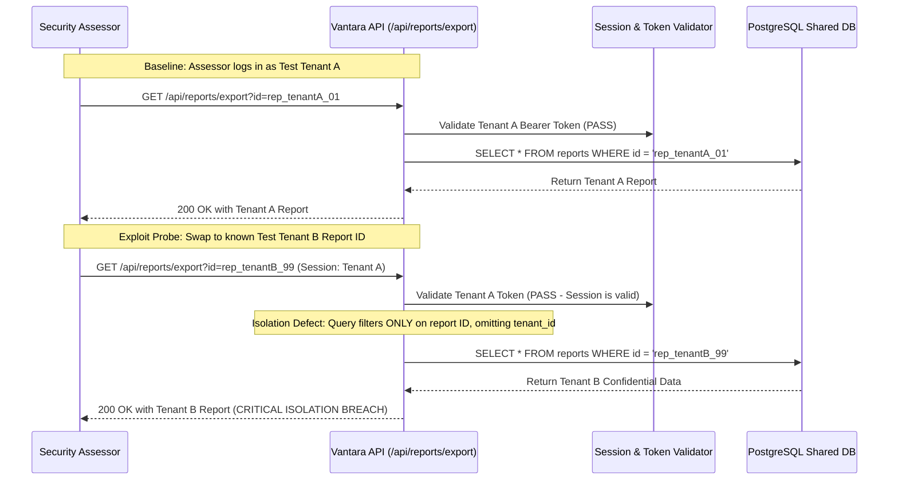

## Definition

Cross-tenant isolation failure happens on a platform that serves multiple customers, tenants, from
shared underlying infrastructure, when a gap in that isolation lets one tenant read, modify, or
otherwise affect another tenant's data or resources. The platform is working exactly as designed for
every individual tenant in isolation; the failure is specifically in the boundary meant to keep those
tenants apart on infrastructure they don't know, and shouldn't need to know, is shared at all.

## The Trust Boundary That Breaks

Multi-tenancy exists because sharing infrastructure across customers is more efficient than giving
every customer their own fully dedicated environment, and the entire arrangement depends on a logical
isolation layer doing the job physical separation would otherwise do. Each tenant trusts that the
platform enforces this separation on every single code path that touches shared data, without
exception: every query, every cache lookup, every background job, every identifier passed between
components.

That's a very large surface to get right consistently, and it only takes one path where a tenant
identifier is missing from a query, inferred incorrectly from user-controllable input, or reused
across a caching or queuing layer without being re-checked, for the isolation boundary to fail on that
one path while holding everywhere else. The tenant on the other side of that gap never opted into
sharing anything; they typically don't even know which other tenants share the same platform.

## Where It Actually Shows Up

- A shared database query missing a tenant-identifier filter on one specific endpoint, while every
  other endpoint correctly scopes its queries, often because that one endpoint was added later or
  built by a different part of the team.
- A tenant identifier passed as a client-controllable parameter (a request body field, a URL
  parameter) rather than derived server-side from the caller's own authenticated session, letting a
  tenant simply substitute another tenant's identifier into the request.
- Shared caching or message-queue infrastructure where a cache key or queue message doesn't fully
  encode which tenant it belongs to, so a race condition or key collision returns one tenant's cached
  result, or delivers one tenant's queued job, to another.
- Background or batch jobs that process records across all tenants in a single pass, where a bug in
  how the job attributes its output can misfile a result under the wrong tenant.
- Tenant-specific configuration or feature-flag data stored in a way that's readable across tenants
  even when the underlying business data itself is correctly isolated, exposing what features or
  settings another tenant has enabled.

## Why It Keeps Happening

Correct tenant isolation has to be re-verified on every single new code path that touches shared data,
indefinitely, for as long as the platform keeps growing. A team can get isolation right on the
platform's original core paths and still introduce a gap on a new feature built months or years later,
especially if the pattern for enforcing isolation isn't automatically applied by a shared framework
layer and instead depends on every individual developer remembering to add the tenant filter by hand,
every time, on every new query.

## How to Find It

1. As an authenticated tenant, systematically substitute another tenant's identifiers (in URL
   parameters, request bodies, or referenced resource IDs) into requests, checking whether the
   response returns data belonging to that other tenant, using only test accounts created for the
   assessment.
2. Pay particular attention to newer or less-used features and background/batch functionality, since
   isolation gaps concentrate in code paths added after the platform's original, more heavily reviewed
   core.
3. White-box, review whether tenant scoping is enforced centrally, at a shared data-access layer every
   query passes through, versus repeated individually in each endpoint's own code; the latter pattern
   is far more likely to have at least one path where the check was missed.
4. Review caching and queuing infrastructure specifically for whether tenant identity is fully encoded
   in cache keys and queue messages, not just checked at the point data enters the cache or queue.

## Impact by Scenario

| Scenario | Realistic impact |
|---|---|
| Isolation gap exposes only non-sensitive, shared reference data | Low; unintended but not meaningfully sensitive |
| Isolation gap exposes one tenant's configuration or usage metadata to another | Medium; a real confidentiality failure, bounded scope |
| Isolation gap exposes another tenant's customer or business data | Critical; a direct breach of contractual and often regulatory data-separation obligations |
| Isolation gap allows one tenant to modify or delete another tenant's data | Critical; breach plus data integrity or availability impact |

## Why a Business Should Care

For a platform whose entire commercial model depends on multiple customers trusting shared
infrastructure, a cross-tenant isolation failure is close to the worst-case finding: it directly
contradicts the specific promise, "your data is kept separate from every other customer on this
platform," that multi-tenant SaaS is built on. Beyond the direct breach-notification and regulatory
consequences, this is the finding category most likely to trigger a contractual dispute, since
enterprise contracts frequently include explicit data-isolation guarantees, and it's a reputational
risk that spreads specifically among a SaaS platform's own customer base, the exact audience a
provider can least afford to lose confidence with.

## A Worked Example

*(Generalized from real assessment patterns. Company and identifiers below are invented; no real
system or data is referenced.)*

During a multi-tenant application assessment for Vantara Systems, using two separate test-tenant
accounts created specifically for the engagement, a report-export endpoint is found to accept a
report identifier directly from the request without verifying that the identifier belongs to the
requesting tenant. Substituting a report identifier belonging to the second test tenant into a request
authenticated as the first returns the second test tenant's report in full.

Testing confirms the issue using only the two dedicated test-tenant accounts and their own test data,
created solely for this purpose. No real customer tenant's identifiers or data are accessed or
referenced at any point.

## Severity Calibration

This rates **Critical** because the endpoint returned another tenant's actual business data with no
additional authorization check beyond guessing or observing a valid identifier format, a direct,
low-effort cross-tenant data breach. An isolation gap limited to non-sensitive shared reference data,
with no path to real tenant-specific business data, would rate meaningfully lower: severity here
tracks exactly what data or capability crosses the tenant boundary, not the mere existence of a gap in
the abstract.

## Remediation

The real fix is enforcing tenant scoping centrally, at a shared data-access layer every query and job
passes through automatically, rather than as a check each individual developer has to remember to add
per endpoint, combined with deriving tenant identity server-side from the authenticated session rather
than accepting it as a client-supplied value anywhere in the system.

The common bad fix is patching the one endpoint where the gap was found without auditing the rest of
the platform for the same missing-filter pattern elsewhere. Since the root cause is usually structural
(no centralized enforcement point), the same class of gap tends to already exist, undiscovered, on
other endpoints built the same way.

## Related Classes

- **[Broken Access Control](../broken-access-control/)**: the same
  underlying failure, an authorization check that should have limited access but didn't, at the scale
  of an entire tenant rather than a single object or user.
- **[Overly Permissive Cloud IAM](../cloud-iam-misconfiguration/)**:
  a related but distinct failure mode, excess permission granted to a cloud identity, as opposed to a
  missing tenant-scoping check in the platform's own application logic.
