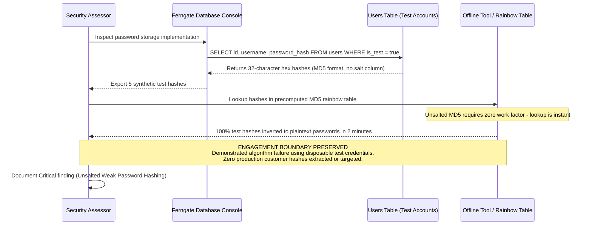

## Definition

Cryptographic failures happen when sensitive data (passwords, payment details, health records, session tokens, personal identifiers) is exposed because it was never encrypted, was encrypted with a broken or outdated method, or had its protection undermined by poor key handling. The data itself was never stolen through some clever technical trick; it was simply never actually protected in the way everyone assumed it was.

## The Trust Boundary That Breaks

The assumption that fails here is treating "encryption" as a single checkbox rather than a set of specific, individually correct decisions: which algorithm, which mode, how long the key is, where the key is stored, and, just as importantly, which data actually needs this protection in the first place. A team can genuinely believe their data is "encrypted" while every one of those specific decisions is wrong.

The real boundary that has to hold is between data that's sensitive and everything that touches it on its way to storage: the application layer, logs, caches, backups, and third-party integrations. If any one of those touchpoints handles the data in plaintext, the fact that the primary database column is encrypted does very little.

## Where It Actually Shows Up

- **Passwords hashed with a fast, general-purpose algorithm** (MD5, SHA-1, or even unsalted SHA-256) instead of a slow, salted, purpose-built password hashing function (bcrypt, Argon2, scrypt), which makes offline cracking of a stolen database dramatically faster than it needs to be.
- **TLS not enforced on every connection**, allowing a client to silently fall back to plaintext HTTP, or internal service-to-service traffic left unencrypted on the assumption that "it's internal, so it's fine."
- **Sensitive data logged or cached in plaintext**, even when the primary database column storing it is properly encrypted, because logging and caching are treated as a separate concern from the main data model.
- **Hardcoded or poorly managed encryption keys**, stored in source code, configuration files committed to version control, or environment variables with far broader read access than the data they protect.

## Why It Keeps Happening

Encryption is treated as a single implementation task rather than an ongoing set of correct decisions that have to hold everywhere sensitive data travels. A team correctly encrypts the primary database column, considers the job done, and never re-examines whether the same data also passes through logs, error-reporting tools, or a caching layer in plaintext along the way. Separately, password hashing in particular suffers from a specific, persistent confusion: many general-purpose hashing functions are fast by design, which is exactly the wrong property for a password hash, since speed that helps a legitimate login also helps an attacker cracking a stolen database offline.

## How to Find It

1. Identify every category of sensitive data the application handles (credentials, payment data, health data, personal identifiers, session tokens) and trace where each one is stored, logged, cached, and transmitted.
2. Check whether TLS is enforced on every endpoint, including internal service-to-service calls, and whether a downgrade to plaintext is actually rejected rather than merely discouraged.
3. If credentials are accessible for review (with authorization, such as during an authorized assessment with database access), check the hashing algorithm in use and whether salts are applied per-record.
4. Search logs, caches, and backups for sensitive data appearing in plaintext even where the primary data store is encrypted.

## Impact by Scenario

| Scenario | Realistic impact |
|---|---|
| TLS not enforced on a low-sensitivity internal endpoint | Limited exposure, bounded by what travels over that specific connection |
| Passwords stored with a fast, unsalted hash, database later exposed by an unrelated flaw | Rapid, large-scale password recovery, compounding into account takeover anywhere those passwords are reused |
| Payment or health data cached or logged in plaintext despite encrypted primary storage | Regulatory exposure (PCI-DSS, HIPAA, depending on data type) even though the "main" storage was technically compliant |
| Hardcoded encryption key exposed through source code or configuration leakage | Total defeat of the encryption scheme; every record it was meant to protect becomes readable |

## Why a Business Should Care

Cryptographic failures are the class most likely to convert an ordinary incident into a regulatory one, because the entire purpose of most data-protection law is to require exactly the specific, correct handling this class fails at. A business that can show its sensitive data was properly encrypted at every touchpoint has a materially different conversation with a regulator or an auditor than one that discovers its "encrypted" password database was actually reversible within minutes. The honest framing for a client: encryption is not a feature you add once, it is a property that has to be verified everywhere the data actually goes, including the places nobody thought to check.

## A Worked Example

*(Generalized from real assessment patterns. Company and identifiers below are invented; no real client, system, or data is referenced.)*

Ferngate Retail's customer authentication system, reviewed with authorization during a security assessment, stores passwords as unsalted MD5 hashes. A small set of intentionally created test-account passwords, chosen specifically to be weak and disposable for this purpose, are hashed and then checked against publicly available rainbow tables and general-purpose cracking tools.

Every test hash is recovered within minutes. The absence of a salt means identical passwords across different accounts produce identical hashes, and the fast, general-purpose nature of MD5 means even non-trivial passwords fall quickly to modern cracking hardware. No real customer password is ever targeted or recovered; the test set is sufficient to prove the algorithm choice itself is the failure, independent of how strong any individual user's actual password might be.

## Severity Calibration

This instance rates **Critical**: the flaw affects the entire user base uniformly (every password in the database is protected by the same weak scheme), the technique required to exploit it is publicly available and fast, and the resulting exposure (account takeover at scale, likely extending to other services through password reuse) is severe. A cryptographic weakness confined to a narrow, low-sensitivity data field with no broader reuse risk would rate lower; what drives this rating is the combination of scope (the whole user base) and downstream reach (credential reuse elsewhere), not the mere presence of a weak algorithm in the abstract.

## Remediation

The real fix is a purpose-built, slow, salted password hashing algorithm (bcrypt, Argon2, or scrypt, each with parameters tuned to current hardware) for anything password-related, combined with enforced TLS on every connection with no plaintext fallback, and a deliberate audit of every place sensitive data travels, not just its primary storage location.

The common bad fix is treating "we use HTTPS" as a complete answer. HTTPS protects data in transit between the browser and the server; it says nothing about how that data is stored once it arrives, how it's hashed, or whether it later ends up in a log file or cache in plaintext. Transit protection and storage protection are two separate problems, and fixing one does not fix the other.

## Related Classes

- **[Identification and Authentication Failures](../authentication-failures/)**: a closely adjacent
  class worth checking as a pair, weak password hashing here, weak login and session handling there,
  since a real assessment frequently finds both on the same application.
- **[AI Sensitive Information Disclosure](../ai-sensitive-information-disclosure/)**: the same root
  failure, sensitive data left unprotected, showing up in an AI system's outputs and training data
  instead of a database column.
