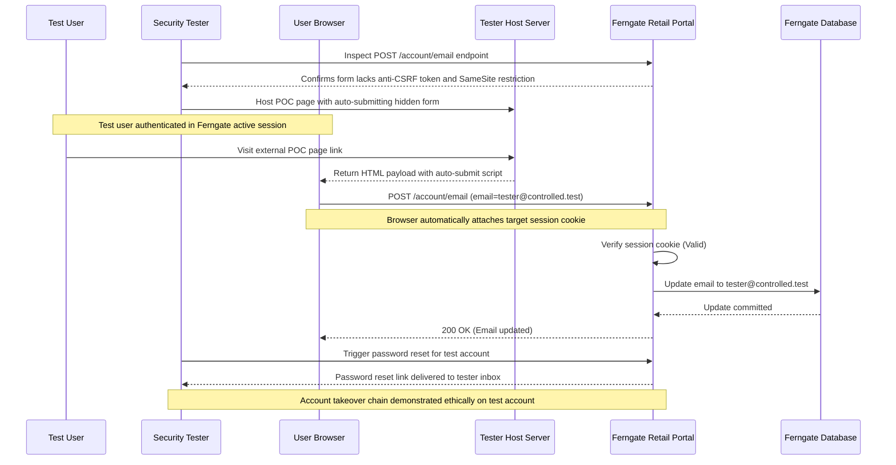

## Definition

Cross-Site Request Forgery, almost always shortened to CSRF, happens when a victim's own browser is
tricked into sending a real, authenticated request to a target site, without the victim ever meaning
to send it. It works because browsers automatically attach cookies and session credentials to any
request they send to a site, regardless of which page actually triggered that request. A malicious
page hosted anywhere else can quietly cause the victim's browser to fire off a request that looks,
from the target server's point of view, exactly like something the victim did on purpose.

## The Trust Boundary That Breaks

The server's trust assumption is: *a request carrying a valid session cookie represents something
this user actually intended to do.* That assumption is only half right. A session cookie proves who
is asking. It says nothing about whether the person asking meant to ask, or even knows a request was
sent at all. The actual trust boundary that has to hold is between "this browser is authenticated"
and "this specific action was deliberately triggered by the user," and CSRF exists precisely because
most applications never draw that second line. If a state-changing endpoint accepts any request that
carries a valid cookie, with no additional proof of intent, the boundary was never really there.

## Where It Actually Shows Up

- State-changing actions with no CSRF protection at all: changing an email address, changing a
  password, updating account or notification settings, transferring funds.
- Endpoints that accept the same state-changing action over a plain GET request. If an action can be
  triggered by a link, or even an embedded image tag, it can be forged with almost no friction, no
  hidden form or JavaScript required on the attacker's page.
- Newer endpoints added after the original CSRF protection was put in place, especially ones built by
  a different developer or team who didn't know the protection had to be applied by hand.
- APIs that skip CSRF protection on the (often false) assumption that "it's an API, not a browser
  form," while still authenticating requests using a cookie a browser will happily attach automatically.

## Why It Keeps Happening

CSRF protection is not something a framework gives you automatically just by existing. It has to be
deliberately wired into every state-changing endpoint, either by hand or through framework-wide
middleware that a team has to actually enable and keep enabled. A codebase that protects its original
core endpoints well can still leave a newer, less-reviewed endpoint completely exposed, because
nobody re-checked whether the same protection was applied. Reviving an old debug or admin action that
skips the usual request pipeline is another common way this reappears in code that was otherwise
protected everywhere else.

## How to Find It

1. Enumerate every state-changing request in the application: anything that creates, updates, or
   deletes something, or changes account state.
2. For each one, replay the same request from a different origin (a simple hosted test page works)
   without the anti-CSRF token the application normally sends, and see whether it still succeeds.
3. Explicitly check whether the same state-changing action can also be triggered over GET. A
   GET-based state change removes even the minimal friction a POST-only form requires and is
   significantly easier to weaponize (a plain link or an auto-loading image is enough).
4. If a token is present, confirm it's actually validated server-side and tied to the current
   session, rather than merely expected to be present. A token that's checked for existence but not
   correctness provides no real protection at all.

## Impact by Scenario

| Scenario | Realistic impact |
|---|---|
| A low-value preference or display setting can be changed via CSRF | Minor: annoying, rarely worth escalating on its own |
| An email-change endpoint accepts a forged request, and password reset relies on that email | Serious: chains directly into full account takeover through the password-reset flow |
| A funds-transfer or purchasing action accepts a forged request | Critical: direct, real-world financial loss with no further chaining required |
| The application enforces SameSite cookies and a validated per-session token everywhere | Attack surface is closed even if a specific endpoint's own logic has other flaws |

## Why a Business Should Care

CSRF is easy to underestimate because the vulnerable request itself often looks completely ordinary
in server logs: a real, valid, authenticated request from a real user's browser. There's no
suspicious payload to point at the way there is with an injection flaw. That's exactly what makes it
dangerous to dismiss: an attacker doesn't need to steal a credential or break authentication at all,
they only need to get a logged-in victim to load a page, and the browser does the rest. When
explaining this to a client, the useful framing is that CSRF turns *being logged in* itself into the
exposure, which is why it has to be defended against by design on every state-changing endpoint, not
patched in reactively after one is found.

## A Worked Example

*(Generalized from real assessment patterns. Company and identifiers below are invented; no real
system, client, or data is referenced.)*

During an assessment of Ferngate Retail's customer account portal, the "update contact email"
endpoint is found to accept a standard form submission with no anti-CSRF token present anywhere in
the request or the page that generates it. A minimal, self-submitting test page is built that points
at the exact same endpoint, hosted entirely outside the target application. When a test account,
already logged into the real application in one browser tab, simply loads that unrelated test page,
the account's email address changes to the address specified in the forged request, with no further
action from the test user at all.

Because the application's password-reset flow sends its reset link to whatever email address is
currently on file, this single CSRF-forgeable endpoint is sufficient to demonstrate a full account
takeover path: change the email via CSRF, then trigger and receive a password reset at the
attacker-controlled address. Testing stops at proving this chain end to end on the test account
itself; no other account's email or password is ever touched.

## Severity Calibration

This instance rates **High**, reflecting a real account-takeover path with an authenticated but
otherwise ordinary attacker requirement (getting a logged-in victim to load one page). It falls short
of the top of the scale only because it still requires some form of victim interaction, unlike a fully
unauthenticated, zero-click vulnerability. The severity here comes entirely from what the specific
forged action unlocks: this same underlying flaw on a low-value display setting, with no path to
account takeover, would rate far lower. The vulnerability class never sets the rating by itself.

## Remediation

The real fix is a unique, unpredictable anti-CSRF token, generated per session, required on every
state-changing request, and actually validated server-side against the session it was issued to, combined
with the `SameSite` cookie attribute set to `Lax` or `Strict` as defense-in-depth so the browser itself
stops attaching the cookie to most cross-site requests in the first place. State-changing actions
should also never be reachable over a plain GET request.

The common bad fix is checking the `Referer` or `Origin` header alone and calling it done. Those
headers can be absent in legitimate traffic, stripped by privacy-focused browser settings or
extensions, and are not a substitute for an actual token tied to the session. A defense that silently
fails open whenever the header is simply missing is not a real fix.

## Related Classes

- [Broken Access Control](../broken-access-control/): a different failure at a related layer. Broken
  Access Control is about whether an authenticated user is *allowed* to do something; CSRF is about
  whether they actually *asked* to do it at all. Both ultimately come down to the same question a
  server has to answer correctly: what, exactly, does this request prove?
