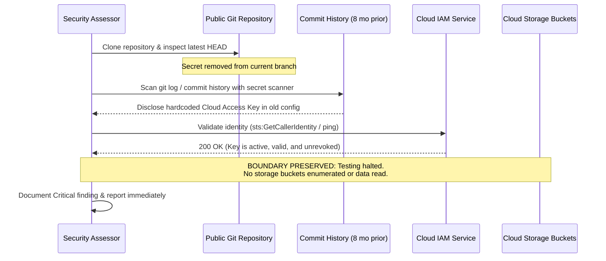

## Definition

Exposed cloud credentials happen when a long-lived access key, API token, or connection secret for a
cloud service ends up somewhere it can be found by someone who was never supposed to have it: a public
or shared code repository, a container image layer, a CI/CD pipeline log, a client-side application
bundle, or a configuration file included by mistake. The credential itself is usually valid and
working. It was simply stored somewhere with far weaker protection than the access it actually grants.

## The Trust Boundary That Breaks

A developer places a credential in a config file or environment setup script assuming that file's own
access boundary, a private repository, a local development machine, an internal deployment pipeline,
is the only boundary that credential will ever cross. That assumption breaks constantly: repositories
get made public by accident, container images get pushed to a registry with broader read access than
intended, CI logs echo environment variables during a debugging session, and client-side bundles are,
by definition, downloaded and inspectable by anyone who loads the page.

The trust boundary that has to hold is the separation between "where this credential is stored" and
"who can access that storage location." A secret is only as protected as the least-protected place it
has ever been written to, including places nobody remembers it was written to, like an old commit
still present in a repository's history after the offending line was later removed.

## Where It Actually Shows Up

- Cloud access keys or connection strings committed directly into application source code, especially
  in a configuration or settings file that's easy to forget isn't meant to be committed at all.
- Secrets baked into a container image during build (copied in, or set via a build argument that
  persists in an image layer), rather than injected at runtime from a secrets manager.
- CI/CD pipeline logs that print environment variables during a debugging step, leaving the secret
  readable to anyone with access to build logs, which is often a much larger group than the group with
  access to the secret's intended storage location.
- Client-side web or mobile application bundles containing a cloud API key that was meant for
  server-side use only, discoverable by anyone who inspects the shipped application code.
- A secret that was committed and later removed from the latest version of a file, but still present
  and retrievable in the repository's commit history.
- Credentials shared informally between team members through chat or email as a workaround, which
  leaves the secret sitting in a place with no access controls or expiration tied to the secret at
  all.

## Why It Keeps Happening

Hardcoding a credential directly is the fastest way to get a local development environment working,
and secrets-management tooling, while widely available, adds a setup step that's easy to skip under
time pressure or simply not know to do yet. Once a credential is hardcoded and the code works, there's
no natural moment that forces a revisit: the application keeps functioning correctly with the secret
sitting in plain text, and the mistake only becomes visible when someone or something specifically
goes looking for it, whether that's a security reviewer or an attacker.

## How to Find It

1. Scan source repositories, including their full commit history, not just the current state of the
   codebase, for patterns matching common cloud credential formats.
2. Inspect container images layer by layer, not just the final running container, since a secret
   copied in during an early build step can persist in an intermediate layer even if a later step
   deletes the file.
3. Review CI/CD pipeline logs for any step that prints environment variables or command output that
   might include a secret value, and check who has access to view those logs.
4. For client-facing applications, review the actual shipped bundle (the JavaScript delivered to a
   browser, the compiled mobile application) for any embedded key, since anything shipped to a client
   should be treated as public regardless of how it was intended to be used.
5. Where a credential is found, confirm only that it is live and scoped to what it claims (a directed,
   minimal check, like confirming the key authenticates successfully), rather than exercising the
   access it grants any further than necessary to prove the finding.

## Impact by Scenario

| Scenario | Realistic impact |
|---|---|
| Exposed key has already been revoked or was scoped to a disposable test environment | Low; no live impact, but the storage practice is still a finding |
| Exposed key grants read access to non-sensitive resources | Medium; limited direct impact, still a real exposure |
| Exposed key grants broad account or administrative access | Critical; direct path to a full cloud account compromise |
| Exposed key is discoverable by the public (public repository, client-side bundle) rather than only an internal audience | Elevates any of the above by at least one severity level, given the far larger population that can find it |

## Why a Business Should Care

An exposed credential is one of the most common single starting points for a large-scale cloud
breach, and it's a cost category that compounds with time: every day a live, exposed key goes
unnoticed is another day it's usable by whoever finds it, and there is no way to know in advance
whether anyone already has. This is a strong argument for automated secret-scanning as baseline
practice, not an optional extra, because the alternative is depending entirely on nobody with bad
intent ever looking, which is not a control a business can honestly claim to a client, an auditor, or
its own board.

## A Worked Example

*(Generalized from real assessment patterns. Company and identifiers below are invented; no real
system or data is referenced.)*

While reviewing Northfell Systems' public-facing repository as part of an authorized assessment, a
configuration file committed roughly eight months earlier, and since removed from the current version
of the codebase, is still present in the repository's commit history and contains a cloud storage
access key in plain text. Confirming the key's format matches the provider's standard pattern, a
minimal, read-only authentication check confirms the key is still live and valid.

Testing stops at confirming the key authenticates successfully. No storage resource is listed, read,
or modified using the key beyond what the single authentication check required, and the finding is
reported immediately given the live nature of the exposure.

## Severity Calibration

This rates **Critical** because the key was both live and publicly discoverable in a repository
anyone could access, with no way to know how long it had already been exposed or to whom. An
identical exposure of a key already revoked, or scoped to a disposable, empty test resource, would
rate substantially lower: severity tracks whether the credential is live and what it actually grants
access to, not merely the fact that a secret was found in an unintended location.

## Remediation

The real fix is a secrets manager: credentials generated, stored, and injected into an application at
runtime, never written into source code, container images, or logs, combined with short-lived,
automatically-rotating credentials wherever the provider supports them, so a leaked credential has a
short useful window even if it does escape. Automated secret-scanning on every commit and every build
catches new instances before they ship, and any exposed credential found should be revoked and
rotated immediately, not just removed from the current codebase.

The common bad fix is deleting the offending line from the latest commit and considering the issue
closed. The secret remains fully retrievable from the repository's history indefinitely unless it is
also revoked at the source, which is the step that actually neutralizes the exposure.

## Related Classes

- **[Insecure Infrastructure as Code (IaC)](../insecure-infrastructure-as-code/)**:
  a hardcoded secret written directly into a deployment template is one specific, high-frequency way
  this class shows up.
- **[Server-Side Request Forgery](../ssrf/)**: a different path to the same kind of
  outcome, live cloud credentials falling into the wrong hands, this time through a runtime request to
  a cloud metadata endpoint rather than a secret stored insecurely at rest.
