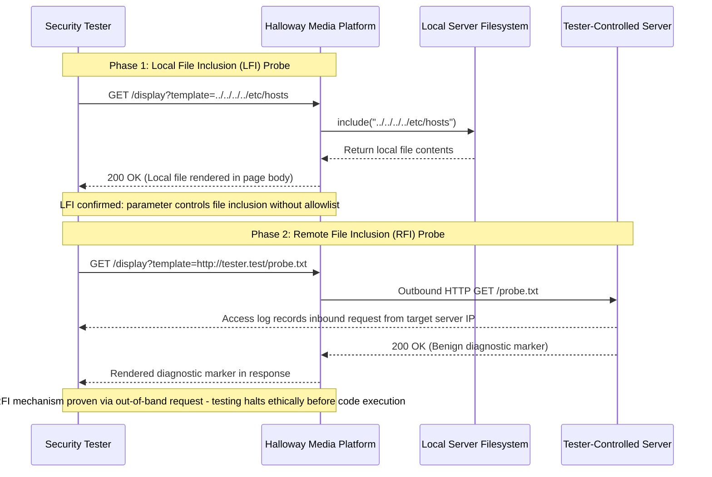

## Definition

A file inclusion vulnerability exists when a feature dynamically includes or executes a file based
on a user-supplied parameter, a pattern common in server-side templating and scripting setups.
**Local File Inclusion (LFI)** tricks that feature into including an unintended file already present
on the server. **Remote File Inclusion (RFI)** tricks it into fetching and executing a file from a
remote, attacker-controlled location entirely outside the server. They share the same root
mechanism, a user-controlled "which file" parameter, but differ sharply in severity: RFI hands an
attacker direct remote code execution immediately, since the included file's content is entirely
attacker-controlled from the first request, while LFI's impact depends on what local files happen to
be reachable and whether any of them can first be seeded with attacker-controlled content before
being included as code.

## The Trust Boundary That Breaks

The application trusts that a filename, template name, or "page" parameter will only ever reference
one of a small, intended set of files, without actually restricting it to that set anywhere in code.
The parameter looks like ordinary configuration data to whoever built the feature, not like a
security-sensitive decision about which file on disk, or on the internet, gets executed next.

## Where It Actually Shows Up

- A `page` or `template` query parameter that controls which file a script includes to render a
  response.
- Plugin or module-loading systems that accept a file path or URL as configuration, intended for
  legitimate extensibility but reachable by an ordinary user-facing parameter.
- Legacy applications built around dynamically including files by name, often predating more
  structured routing approaches that avoid this pattern entirely.
- Multi-language sites that select a template file based on a locale or language parameter, a
  common, easy-to-miss instance of this exact pattern.

## Why It Keeps Happening

Dynamic file inclusion by parameter is a convenient, fast way to build a flexible, template-driven
application, and it's easy to overlook that "which file to include" is itself a security-sensitive
decision rather than ordinary application logic, precisely because it feels like configuration, not
a security control. Once a codebase established the pattern for one legitimate use case, it's often
reused elsewhere without anyone revisiting whether the new use case actually needs the same
unrestricted flexibility.

## How to Find It

1. For LFI, supply path traversal sequences or absolute file paths in the inclusion parameter and
   check whether the response reflects content from an unexpected file rather than the intended
   template.
2. For RFI specifically, supply a URL pointing at a controlled test server you own, and check that
   server's own logs for an inbound request from the target application, confirming remote fetch
   behavior before ever attempting to escalate toward execution.
3. Test every parameter that resembles a filename, template identifier, or module reference
   independently; a fix applied to one such parameter elsewhere in the same application doesn't
   guarantee every instance was fixed the same way.
4. Stop at proof of inclusion or remote fetch. Confirming the mechanism works is sufficient; there's
   no need to actually achieve or demonstrate full code execution against a real environment to
   prove the class of flaw exists.

## Impact by Scenario

| Scenario | Realistic impact |
|---|---|
| LFI reaching a non-executable, non-sensitive file | Limited: information disclosure only, bounded to what that specific file reveals |
| LFI reaching a log file or other file that can first be seeded with attacker-controlled content | Critical: the seeded content becomes executable once included, escalating to code execution |
| RFI with unrestricted outbound network access confirmed | Critical: immediate remote code execution, since the included file's content is fully attacker-controlled from the start |

## Why a Business Should Care

File inclusion flaws routinely escalate from "we found an odd parameter" to full server compromise
faster than almost any other class on this site, because the gap between proving the flaw exists and
achieving code execution can be a single additional step, especially for RFI. The useful thing to
tell a client is that any feature letting a URL or filename influence what code the server runs next
deserves the same scrutiny as a direct code-execution feature, even if it was never designed or
described that way internally.

## A Worked Example

*(Generalized from real assessment patterns. Company, product, and identifiers below are invented;
no real system, client, or data is referenced.)*

Halloway Media's content platform selects a display template using a `template` query parameter.
Supplying a path traversal sequence in that parameter causes the response to include and reflect the
contents of a known, non-sensitive local file, confirming the LFI mechanism directly: the parameter
controls file inclusion with no restriction to an intended set of templates.

To confirm the RFI variant would follow an identical pattern, a second request supplies a URL
pointing at a test server under the tester's own control instead of a local path. That server's
access logs confirm an inbound request from Halloway Media's application, proving the same
parameter also accepts and fetches a remote URL, not only local paths. Testing stops at that
confirmation; no attempt is made to host or execute an actual payload through the confirmed remote
fetch, since proving the mechanism itself is sufficient evidence of the vulnerability's ceiling.

## Severity Calibration

This instance rates **Critical**, driven specifically by the confirmed RFI capability: a parameter
that fetches an arbitrary attacker-controlled remote URL provides a direct path to remote code
execution, independent of what happens to be reachable locally. Had testing confirmed only the LFI
variant, reaching solely non-executable, non-sensitive local files, the rating would sit
considerably lower; it's the demonstrated remote-fetch capability that sets the ceiling here, not
the inclusion mechanism in the abstract.

## Remediation

The real fix is never accepting a raw file path or URL from user input for inclusion purposes at
all. Map any user-facing selection (a template choice, a language selection) to a fixed, server-side
allowlist of known-safe identifiers, and resolve the actual file path from that allowlist internally,
never from the user-supplied value directly.

The common bad fix is validating that the input "looks like" a filename, for instance checking for
an expected file extension, without actually restricting it to an allowlist. This does nothing to
prevent path traversal sequences or remote URLs that happen to also satisfy that same surface-level
check, and it treats a structural access-control problem as if it were a string-formatting problem.

## Related Classes

- **[Server-Side Request Forgery](../ssrf/)**: the RFI variant is structurally a specific case of
  SSRF, where the fetched, attacker-controlled content is then executed rather than merely read.
- [Path Traversal](../path-traversal/): the technique most commonly used to reach an unintended local
  file for the LFI variant specifically.
