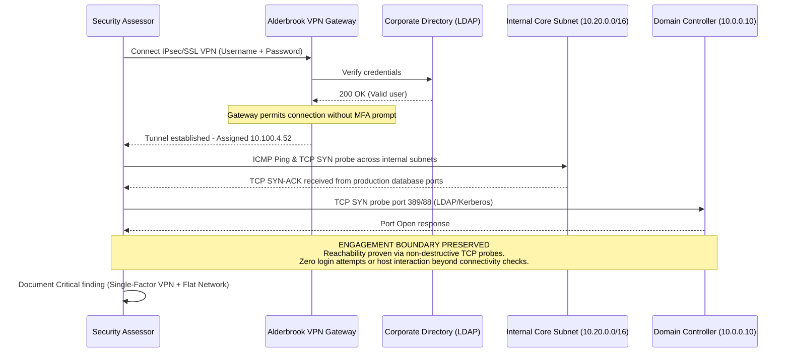

## Definition

Insecure VPN and remote access configuration covers the ways a remote-access solution, meant to let a
legitimate remote user reach internal resources without exposing those resources directly to the
internet, can itself become the weak point instead. This includes weak or single-factor
authentication on the VPN itself, an outdated or vulnerable VPN protocol, and remote-access
configurations that grant a connected client far broader network reach than their actual work
requires.

## The Trust Boundary That Breaks

A VPN exists specifically to extend a trusted internal network boundary out to a remote user, and the
entire model depends on the authentication gate at the VPN itself being at least as strong as the
protections it's substituting for physical presence in the office. When that gate is weak, a single
factor of authentication, a reused or easily guessed credential, an outdated protocol with known
weaknesses, the VPN stops functioning as a trust boundary and starts functioning as an open door with
extra steps. A second, related failure compounds this: once connected, a client is often granted much
broader network reach than their actual task requires, because segmenting VPN client access to only
the specific resources a given remote user needs is more work than granting broad access to the whole
internal network once they're connected.

## Where It Actually Shows Up

- VPN authentication relying on a single factor (username and password alone), with no second factor
  required, making a phished, reused, or brute-forced credential sufficient on its own for a remote
  attacker to connect.
- VPN infrastructure running an outdated protocol or unpatched software with publicly known
  vulnerabilities, left in place well past when an upgrade path was available.
- Split-tunneling configurations that don't meaningfully restrict what a connected client can reach
  once inside, granting the same broad access a device physically on the internal network would have
  rather than a scoped subset relevant to that user's actual role.
- Remote-access credentials or configuration profiles shared broadly among a team or department rather
  than issued individually, making it impossible to attribute a specific connection to a specific
  person or to revoke access for one departing individual without affecting everyone else.
- VPN administrative or management interfaces themselves reachable from the general internet with the
  same weak authentication protecting the client-facing service.

## Why It Keeps Happening

Rolling out multi-factor authentication and finely scoped, per-role network access for remote users is
genuinely more operational overhead than a single shared credential and broad access granted once at
setup, and remote access is often provisioned under time pressure, during a rapid shift to remote
work, or for a new hire who needs to be productive immediately. VPN infrastructure, once configured
and working, is also easy to treat as "done" rather than something requiring the same ongoing patching
and access review discipline as any other internet-facing service.

## How to Find It

1. Review whether VPN authentication requires a second factor beyond a password, and if authorized,
   test whether a weak or reused credential can successfully authenticate.
2. Confirm the VPN software and protocol version in use against known, publicly disclosed
   vulnerabilities for that specific version.
3. From an authenticated remote-access test connection, using a test account provisioned for this
   assessment, enumerate what's actually reachable and compare it against what that account's role
   should legitimately need.
4. Check whether the VPN's own administrative interface is reachable from the general internet, and if
   so, what authentication protects it.

## Impact by Scenario

| Scenario | Realistic impact |
|---|---|
| Multi-factor authentication enforced, client access scoped narrowly by role | Attack surface effectively minimized |
| Single-factor authentication, but connected client access is narrowly scoped | Medium to High; a compromised credential still has limited practical reach |
| Multi-factor authentication enforced, but connected client reaches the entire internal network | High; a legitimate but over-broad grant, exploitable if any connected account is compromised |
| Single-factor authentication combined with broad, unscoped network access once connected | Critical; a single phished or guessed credential grants full internal network reach remotely |

## Why a Business Should Care

VPN and remote access is one of the most common initial-access paths into an organization precisely
because it's designed to be reachable from anywhere, which is also exactly what makes it attractive to
attack. The clearest way to frame this to a client: the VPN is functionally the new network perimeter
for a remote or hybrid workforce, and it deserves the same rigor, multi-factor authentication, current
patching, and least-privilege scoping, as any other primary access control, not the "set it up once and
move on" treatment it often gets in practice.

## A Worked Example

*(Generalized from real assessment patterns. Company and identifiers below are invented; no real
system or data is referenced.)*

During an external assessment of Alderbrook Media's remote-access infrastructure, the VPN gateway is
found to require only a username and password, with no second authentication factor. Using a test
account provisioned for this assessment, authentication succeeds with no additional prompt. Once
connected, network enumeration confirms reachability well beyond the specific application the test
account's role was scoped to use, including internal systems with no apparent relevance to that role.

Testing is limited to the test account created for this assessment, and network reachability is
confirmed through connectivity checks alone. No system reached through the VPN connection is accessed
or interacted with further.

## Severity Calibration

This rates **Critical** because single-factor authentication combined with broad, unscoped network
reach means any single compromised remote-access credential, obtained through phishing, credential
reuse, or brute force, grants an attacker the same practical reach as a legitimate remote employee,
with no additional barrier. The identical single-factor authentication gap on a VPN scoped narrowly to
one specific, low-sensitivity application would rate meaningfully lower: severity tracks what a
successful connection actually grants access to, not the authentication weakness alone.

## Remediation

The real fix is enforcing multi-factor authentication on all remote access without exception, keeping
VPN software and protocols current against known vulnerabilities, and scoping connected client access
to the specific resources a given role actually requires rather than the entire internal network by
default, the same least-privilege principle applied to any other access grant.

The common bad fix is adding multi-factor authentication as an optional feature users can enable for
themselves, rather than an organization-wide enforced requirement. Voluntary adoption of a security
control reliably lags well behind the assumption that it's actually in place everywhere it needs to
be.

## Related Classes

- **[Network Segmentation Failures](../network-segmentation-failures/)**:
  what determines the actual damage once a remote-access credential is compromised, since a
  well-segmented internal network limits what a VPN connection alone can reach.
- **[Weak or Missing Network Access Controls](../weak-network-access-controls/)**:
  the specific mechanism that should scope a connected VPN client's reach, and frequently doesn't.
