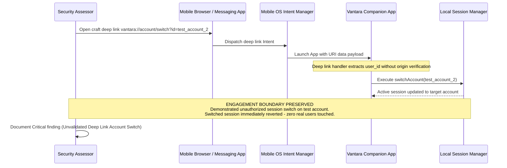

## Definition

Insecure WebView and deep link handling covers two related mobile-specific surfaces: a WebView (an
embedded browser component inside a native app) configured to load or execute content with no
validation of its source, and a deep link or universal link handler that acts on parameters from an
incoming link without verifying where that link actually came from or what it actually contains. Both
give an attacker a way to inject behavior into the app through a channel the app itself opens, rather
than through its own primary UI.

## The Trust Boundary That Breaks

A native app embedding a WebView is, in effect, embedding a browser, and everything that makes
[Cross-Site Scripting](../cross-site-scripting/) dangerous in a real browser applies just as directly
inside a WebView, plus mobile-specific extensions: many WebView configurations expose a JavaScript
bridge letting web content inside the WebView call directly into the native app's own code, which
means script running inside the WebView can potentially trigger native functionality, not just
manipulate a web page. Developers building this integration frequently trust that only their own,
intended content will ever load inside it. Deep links carry a parallel but distinct trust failure: a
developer builds a deep link handler assuming it will only ever be triggered by the app's own,
legitimate flows, when in fact any other app on the device, or a link in a message or webpage, can
trigger it with arbitrary attacker-chosen parameters.

## Where It Actually Shows Up

- A WebView configured to load content from any URL, including one supplied by an untrusted source
  (a message, a redirect, user-supplied input) rather than a fixed, trusted set of origins.
- A JavaScript bridge exposed to WebView content with no restriction on which loaded pages can invoke
  it, letting any content that ends up in the WebView, not just the app's own intended pages, call
  directly into native functionality.
- A deep link handler that performs a sensitive action (logging a user in as a specific account,
  navigating to a privileged screen, modifying application state) directly from unvalidated parameters
  in the incoming link, with no check on where the link actually originated.
- Universal links or app links with no server-side association verification, letting another app on
  the device register and intercept links intended for the legitimate app.
- WebView settings left at permissive defaults (file access, mixed content, unrestricted JavaScript
  execution) that were only ever needed for a narrow, specific use case.

## Why It Keeps Happening

Embedding a WebView is often the fastest way to reuse existing web content inside a native app, and
exposing a JavaScript bridge is a natural, convenient way to let that embedded content interact with
native features. Deep links are built primarily to solve a legitimate product problem (letting a push
notification or a marketing link open directly to a specific screen), and the security implications of
"anyone can construct a link with any parameters" are easy to overlook when the feature's initial
design and testing only ever exercises the intended, well-formed case.

## How to Find It

1. Review what sources a WebView is permitted to load content from, and test whether it will render
   content from an untrusted or attacker-supplied URL rather than only a fixed, trusted origin.
2. Where a JavaScript bridge is exposed, test whether content loaded from an untrusted source inside
   the WebView can successfully call into it, using a controlled test page rather than a real
   malicious payload.
3. Enumerate the app's deep link and universal link handlers, then craft links with unexpected or
   boundary-case parameters, testing whether any sensitive action executes without additional
   validation of the link's origin or the parameters themselves.
4. Verify universal link or app link domain association is correctly configured and enforced, rather
   than assumed, testing specifically whether another app registered for the same scheme can intercept
   relevant links on a test device.

## Impact by Scenario

| Scenario | Realistic impact |
|---|---|
| WebView loads only fixed, trusted content with no exposed native bridge | Attack surface effectively closed for this specific path |
| WebView can load untrusted content but exposes no native bridge to it | Medium; standard web-layer risks apply, without a path to native functionality |
| WebView loads untrusted content and exposes a JavaScript bridge to it | Critical; a path from web-layer script execution directly into native app functionality |
| A deep link triggers a sensitive action from unvalidated parameters with no origin check | High to Critical, depending on what that action actually does |

## Why a Business Should Care

A WebView with an exposed native bridge collapses the usual separation between "web security risk" and
"native app risk" into a single surface, meaning a client that has invested in web application security
testing can still have a serious, unaddressed gap if the mobile team's WebView integration was never
tested with the same rigor. Deep links deserve the same scrutiny as any other externally-triggerable
entry point into the app, since from a security standpoint a deep link is functionally equivalent to
an unauthenticated API endpoint that happens to be triggered by tapping a link instead of sending a
request directly.

## A Worked Example

*(Generalized from real assessment patterns. Company and identifiers below are invented; no real
system or data is referenced.)*

During a mobile assessment of Vantara Systems' companion app, a deep link handler is found to accept
an account identifier parameter and switch the active session to that account with no verification
that the request originated from the app's own legitimate account-switching flow. Constructing a test
link with a second test account's identifier, created for this assessment, and opening it on the test
device causes the app to switch its active session to that account without any additional
confirmation step.

Testing is limited to two test accounts created specifically for this assessment. No real user
account is targeted, and the session switch is confirmed and immediately reverted without further
action taken within the switched session.

## Severity Calibration

This rates **Critical** because the deep link handler performs a sensitive account-level action
directly from an externally-controllable parameter, with no origin verification, meaning any link an
attacker can get a victim to tap (through a message, a malicious webpage, or another app) can trigger
it. A deep link handler that only navigates to a non-sensitive screen with no state-changing effect
would rate substantially lower: severity tracks what the deep link actually does once triggered, not
the mere presence of a deep link handler.

## Remediation

The real fix is restricting WebView content sources to a fixed, trusted allowlist, exposing a
JavaScript bridge only to content loaded from those trusted origins, and validating deep link
parameters and, where the action is sensitive, the link's actual origin before executing anything
state-changing, treating every deep link parameter with the same suspicion as any other
externally-supplied input.

The common bad fix is validating a deep link's parameters for basic format correctness (is this a
valid-looking account identifier) without validating whether the request should be trusted to perform
the action it's requesting at all. A well-formed parameter is not the same thing as an authorized
request.

## Related Classes

- **[Insecure Mobile Authentication & Session Management](../insecure-mobile-authentication/)**:
  a frequent direct consequence, when a deep link can manipulate session or account state without
  proper authorization.
- **[Cross-Site Scripting](../cross-site-scripting/)**: the underlying
  web-layer vulnerability this class inherits and extends the moment an exposed native bridge turns
  script execution inside a WebView into a path to native functionality.
