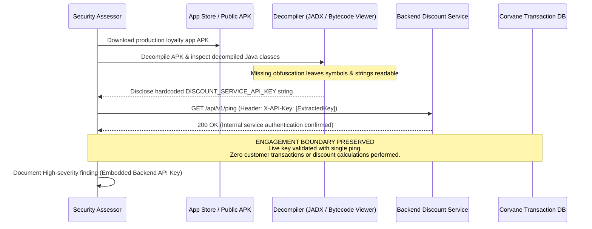

## Definition

Insufficient binary protections is what happens when a compiled mobile application ships with no
meaningful obfuscation, integrity checking, or tamper detection, leaving the app package itself as
readable and modifiable as any other file once it's in an attacker's hands. Server-side code never
leaves infrastructure the developer controls; a mobile app's compiled binary is, by definition,
distributed directly to every user's device, which means it's also distributed directly to every
attacker's device.

## The Trust Boundary That Breaks

Server-side developers rely on the fact that their source code and business logic stay entirely
within infrastructure they control, reachable only through the interfaces they choose to expose.
Mobile developers building with that same mental model overlook a structural difference: the compiled
application itself, not just its network interface, is handed directly to the user, and by extension
to anyone willing to install and analyze it. Decompilation tools can reconstruct a substantial amount
of an app's logic from its compiled form, and without deliberate countermeasures, that logic, along
with any embedded secret or client-side security check, is available to an attacker holding nothing
more than the installed application package.

## Where It Actually Shows Up

- Business logic, pricing rules, feature-gating logic, or client-side validation, implemented in a way
  that's fully readable once the app is decompiled, letting an attacker understand or directly modify
  behavior the developer assumed was opaque.
- Hardcoded secrets, API keys, or cryptographic material embedded directly in the compiled binary,
  extractable through straightforward decompilation and string analysis.
- No integrity or tamper-detection check, letting an attacker modify the app's compiled code directly
  (removing a license check, bypassing a client-side security control, altering displayed content) and
  redistribute the modified version.
- Weak or absent root/jailbreak detection on an app for which running on a compromised device
  materially increases risk, with no fallback behavior (reduced functionality, additional server-side
  scrutiny) when a compromised environment is detected.
- Debug symbols, verbose logging, or development-only code paths left in the production build,
  significantly easing an attacker's analysis effort compared to a properly stripped release build.

## Why It Keeps Happening

Applying meaningful obfuscation and tamper-detection adds real build complexity and ongoing
maintenance overhead, and unlike a functional bug, the absence of these protections causes no visible
problem during normal development or testing: the app works identically for a legitimate user whether
or not it's protected against reverse engineering. That makes this category of protection easy to
deprioritize against features with a clearer, more immediate payoff, until an app is actually
decompiled and analyzed by someone with the intent to do so.

## How to Find It

1. Decompile the application package using standard, publicly available tooling and assess how much of
   the app's actual logic and structure is readable in the output, including class and function names,
   business logic, and any embedded string data.
2. Search decompiled output and app resources directly for hardcoded secrets, API keys, or
   cryptographic material.
3. Test whether the app detects and meaningfully responds to running on a rooted or jailbroken device,
   distinguishing genuine, enforced behavior change from a check that exists but has no real
   consequence when triggered.
4. Attempt to modify a specific, low-risk piece of the app's behavior directly in the decompiled or
   patched binary and reinstall it, to test whether any integrity check detects and blocks a tampered
   version from running.
5. Confirm the production build strips debug symbols and disables verbose logging, rather than
   inheriting a development configuration into the shipped release.

## Impact by Scenario

| Scenario | Realistic impact |
|---|---|
| Decompilation reveals only generic framework code with no meaningful app-specific logic exposed | Low; limited real exposure |
| Decompilation exposes business logic or client-side validation an attacker can now reliably bypass | Medium to High, depending on what that logic actually gates |
| Decompilation exposes a hardcoded secret or API key with real backend access | Critical; a direct credential exposure |
| No tamper detection exists, and a modified version of the app can be redistributed with a security control removed | High; enables broader downstream abuse via a trojanized version of the app |

## Why a Business Should Care

The most useful framing for a client is that a mobile app's compiled binary should be treated as
public from a security-design standpoint, the same way a company would never assume its own server
source code is broadly readable, because it isn't distributed the way a mobile app inherently is. Any
security control, secret, or piece of business logic that only works because "nobody will bother to
decompile it" is not a real control, and testing this class directly is the only way to find out
whether that's the situation before an attacker does the same analysis independently.

## A Worked Example

*(Generalized from real assessment patterns. Company and identifiers below are invented; no real
system or data is referenced.)*

During a mobile assessment of Corvane Retail's loyalty app, decompiling the production build reveals
an internal API key embedded directly as a string constant, used by the app to authenticate to a
backend discount-calculation service. The key is confirmed live through a minimal, directed
authentication check against that service.

Testing stops at confirming the key's presence and validity. No further request beyond the minimal
check needed to confirm the key is live is made against the discount service, and no real customer
account or transaction is affected.

## Severity Calibration

This rates **High** because the exposed key grants access to a real backend service, reachable by
anyone who decompiles a publicly available app, though the specific service's own scope limits the
ceiling relative to a key granting broader account or administrative access, which would justify a
Critical rating instead. Severity for this class always depends on what's actually recoverable from
the decompiled binary, not on the absence of obfuscation in the abstract.

## Remediation

The real fix is layering meaningful protections rather than relying on any single one: code
obfuscation to raise the cost of analysis, integrity and tamper-detection checks that meaningfully
change behavior when triggered rather than existing only nominally, stripping debug symbols and
disabling verbose logging from production builds, and never embedding a long-lived secret directly in
the compiled application regardless of how well it's obfuscated.

The common bad fix is relying on obfuscation alone as if it were encryption. Obfuscation raises the
cost and time required for analysis; it does not make recovery of an embedded secret or business logic
impossible for a sufficiently motivated attacker, and secrets that must stay confidential should never
depend on obfuscation as their actual protection.

## Related Classes

- **[Insecure Mobile Data Storage](../insecure-mobile-data-storage/)**:
  a related risk, often uncovered using the same decompilation and device-analysis techniques this
  class relies on.
- **[Insecure Mobile Authentication & Session Management](../insecure-mobile-authentication/)**:
  a frequent downstream consequence, when a client-side security check exposed by insufficient binary
  protection is also the app's only enforcement of an authentication or authorization decision.
