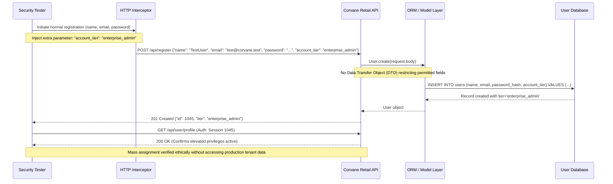

## Definition

Mass assignment happens when a framework's convenience feature automatically maps every field
present in an incoming request body onto an internal object's properties, with no filtering. If an
attacker includes an extra field the developer never intended to expose for editing, like a role or
privilege flag, the framework binds it anyway. Nothing about the request looks malformed: it simply
contains one more field than the form the developer was picturing when they wrote the handler.

## The Trust Boundary That Breaks

The developer's assumption is that only the fields shown on the form, or documented in the API
schema, will ever actually arrive in a request. A raw HTTP request has no such restriction: it can
carry any field name at all, and many frameworks bind whatever arrives directly onto the model
unless a developer explicitly restricts which fields are allowed.

The trust boundary that has to hold is the line between "fields that exist on this object" and
"fields a given caller is allowed to set." Those are two different questions, and mass assignment
happens when the application only ever answers the first one.

## Where It Actually Shows Up

- Account-creation or profile-update endpoints backed directly by an internal model object, rather
  than a narrow, purpose-built input shape.
- APIs that accept a full object representation for updates (send back the whole record to change
  one field) instead of a small, explicit set of editable properties.
- Frameworks whose default object-binding behavior maps request fields onto a model automatically,
  with filtering treated as an opt-in step rather than the default.

## Why It Keeps Happening

Binding an entire request body directly onto an internal model is a fast, convenient default in
many frameworks, and it is easy to overlook that "which fields can this caller actually set" is a
separate security decision from "does this field exist on the model at all." A developer who tests
only the fields their own form actually sends has no reason to notice that the endpoint would also
accept fields it was never supposed to.

## How to Find It

1. For a create or update endpoint, submit the normal expected fields, then add one or two
   additional fields with plausible internal-sounding names, matching what a role, permission, or
   account-status field might realistically be called.
2. Check whether the response, or a follow-up read of the same record, confirms the extra field
   actually took effect, not just that the request was accepted without an error.
3. Test this on every endpoint that accepts a structured object, not only the obvious ones: a
   profile-update endpoint is just as worth testing as an account-registration endpoint.
4. Use a disposable test account for this. If an extra field does take effect, that is the finding;
   there is no need to escalate it further to prove the point.

## Impact by Scenario

| Scenario | Realistic impact |
|---|---|
| Extra field is silently ignored | No impact; this is not a finding |
| A non-sensitive extra field takes effect | Low impact; unintended but not security-relevant on its own |
| A privilege, role, or account-status field takes effect | Critical; a direct, unauthenticated-effort path to privilege escalation |

## Why a Business Should Care

Mass assignment is a good example of a flaw that costs nothing to introduce and everything to
discover late: it requires no attacker sophistication, no custom tooling, just knowledge of what a
plausible internal field name might be. When it reaches a privilege or role field, the business
impact is identical to any other privilege-escalation finding: an ordinary user account effectively
becomes an administrative one, with everything that implies for data access and trust.

## A Worked Example

*(Generalized from real assessment patterns. Company and identifiers below are invented; no real
system or data is referenced.)*

During testing of Corvane Retail's account-registration endpoint, the standard request includes
name, email, and password fields. Adding an additional field, matching the likely name of an
internal account-tier flag, to the same request succeeds without error. A follow-up read of the
newly created test account confirms the field took effect exactly as submitted, elevating the
account beyond its intended default tier.

Testing stops there. The extra field being accepted and taking effect on a disposable test account
is sufficient to prove the vulnerability; no other account is touched, and no further privilege is
exercised beyond confirming the field's effect.

## Severity Calibration

This class rates **Critical** specifically because the affected field controlled account privilege
directly, and no authentication beyond a normal signup was required to reach it. The same
underlying binding behavior, found on a field with no security relevance, would not be a
Critical finding at all: severity here tracks which field was actually reachable, not the presence
of unrestricted binding in the abstract.

## Remediation

The real fix is explicit allowlisting: defining exactly which fields a given request is permitted to
set, and binding incoming data to a purpose-built input shape rather than the internal model object
directly, applied consistently across every endpoint that accepts structured input.

The common bad fix is a denylist of specific sensitive field names. It is easy to miss one field, and
it breaks silently the moment a new sensitive field is added to the model later without someone
remembering to add it to the denylist too.

## Related Classes

- **[Software and Data Integrity Failures](../software-data-integrity-failures/)**:
  the broader OWASP category this class falls under, trusting incoming data structure without
  verifying what it is actually allowed to change.
- **[Broken Access Control](../broken-access-control/)**: the outcome is
  often identical, an unauthorized level of access, even though the mechanism that reaches it here is
  different.
