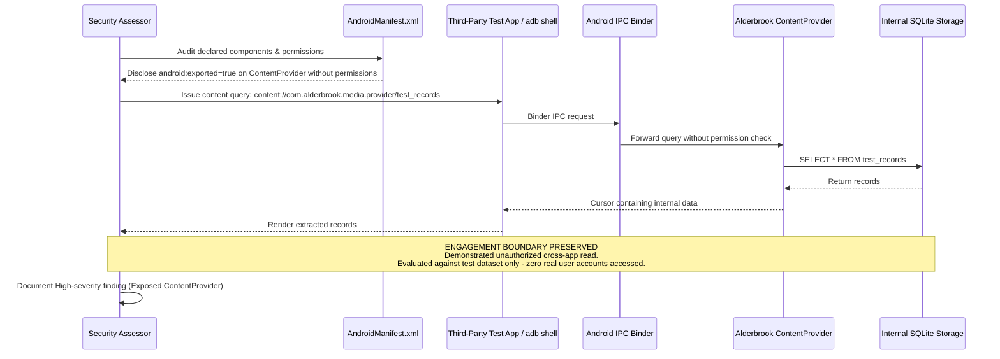

## Definition

Excessive mobile permissions and insecure platform usage covers two closely related mistakes: an app
requesting device-level permissions (contacts, location, camera, storage) beyond what its actual
function requires, and an app misconfiguring the platform's own component-sharing mechanisms (Android
exported components, iOS URL schemes) so that other apps on the same device can interact with parts
of it that were never meant to be reachable from outside. Both mistakes have the same underlying
effect: they expand what's reachable, either by the app itself or by another app on the device, well
beyond the app's actual, intended function.

## The Trust Boundary That Breaks

Mobile platforms are built around a permission model specifically to limit what any single app can
access, on the assumption that each app requests only what it genuinely needs, and users (or a
platform review process) can reason about that request. That model breaks down the moment an app asks
for broad permissions "just in case a future feature needs them," because it silently expands the
blast radius of any future compromise of that app to include everything it was granted, whether or not
it currently uses it. A second, distinct boundary exists at the platform's component-sharing layer:
mobile operating systems let an app expose specific components to other apps deliberately, for
legitimate inter-app functionality, and a misconfiguration here can expose an internal component
meant only for the app's own use to any other app installed on the device.

## Where It Actually Shows Up

- An app requesting broad permissions (full contact list access, precise location at all times, full
  storage access) when its actual feature set only needs a narrow subset, or none, of that access.
- Android application components (activities, services, broadcast receivers, content providers) marked
  exported, intentionally or by an overlooked default, when they were only ever meant to be used
  internally by the app itself, letting any other installed app invoke them directly.
- Custom URL schemes or deep links handled with no validation of the source or content of the
  incoming request, letting a malicious app or a crafted link trigger sensitive functionality the deep
  link handler was never designed to be reached this way.
- Data shared through a platform's inter-app communication mechanism (a content provider, a shared
  clipboard) with no access restriction, readable by any other app on the device rather than only the
  intended recipient.

## Why It Keeps Happening

Requesting broad permissions upfront avoids having to prompt the user again later if a future feature
needs them, and it's a common, low-friction default during development to leave a component exported
or a permission broadly scoped rather than narrowing it deliberately for each specific use case.
Platform tooling generally does not warn a developer that a component is more broadly reachable than
intended, since from the platform's own perspective, an exported component is working exactly as
configured; nothing flags that the configuration itself doesn't match the developer's actual intent.

## How to Find It

1. Review the app's declared permissions against its actual feature set, flagging any permission with
   no corresponding, currently-used feature that requires it.
2. Enumerate the app's exported components directly (from its manifest, for Android, or its declared
   URL schemes and universal links, for iOS) and test whether each one is reachable and functions as
   expected when invoked directly from another, unrelated test app rather than through the app's own
   normal UI flow.
3. Test deep link and URL scheme handlers specifically for missing validation, attempting to trigger
   sensitive functionality through a crafted link rather than only the application's own expected entry
   points.
4. Review any data shared through an inter-app communication mechanism for whether access is actually
   restricted to the intended recipient app, or open to any app installed on the device.

## Impact by Scenario

| Scenario | Realistic impact |
|---|---|
| App requests only permissions its current features genuinely require | Low; matches the intended security model |
| App requests broad, currently-unused permissions "for future features" | Medium; unaddressed exposure, no demonstrated exploitation |
| An exported component or unvalidated deep link allows another app to trigger sensitive functionality | High; a direct, device-local privilege escalation path |
| An exported component exposes sensitive data directly to any other installed app | Critical; a direct, low-effort data exposure to any other app on the device |

## Why a Business Should Care

The device-level blast radius from excessive permissions or an exposed component is easy to
underestimate because it depends on what else is installed on a given user's device, something
entirely outside the organization's own control. The useful framing for a client: every permission
granted and every component exposed is a standing liability that exists whether or not it's ever
actually misused, and the right question to ask isn't "has this been exploited" but "does this app
request and expose only exactly what its current features actually require."

## A Worked Example

*(Generalized from real assessment patterns. Company and identifiers below are invented; no real
system or data is referenced.)*

During a mobile assessment of Alderbrook Media's content app, reviewing the Android manifest reveals
an internal content provider component marked exported with no access permission restriction applied,
intended only for the app's own internal data sharing between its components. Building a minimal, separate
test app and querying that content provider directly, without going through the main app's UI at all,
successfully retrieves data the provider was never intended to expose outside the app itself.

Testing is limited to confirming the exported component returns data to the test app. No real user's
account or content is targeted; the assessment uses only test data created within the app for this
purpose.

## Severity Calibration

This rates **High** because the exported component is reachable and returns real data to any other
app installed on the same device, with no user interaction or special permission required beyond both
apps being installed together, a common and realistic scenario on a personal device. An exported
component that, on inspection, returns only non-sensitive, already-public configuration data would
rate substantially lower: severity tracks what the exposed component actually returns or allows,
not the mere fact that it's exported.

## Remediation

The real fix is requesting only the permissions the app's current feature set genuinely requires,
re-evaluating that list as features are added or removed rather than accumulating permissions
indefinitely, and explicitly marking every component as non-exported unless it has a specific,
reviewed reason to be reachable by other apps, with strict validation applied to any deep link or URL
scheme handler regardless of where the request appears to originate.

The common bad fix is leaving broad permissions and default component visibility in place and relying
on the platform's own app-store review process to catch anything genuinely dangerous. Store review is
not equivalent to a dedicated security assessment and does not reliably catch this class of
misconfiguration, which is functionally correct from the platform's point of view even when it doesn't
match the developer's actual intent.

## Related Classes

- **[Insufficient Binary Protections](../insufficient-binary-protections/)**:
  often discovered using the same decompilation techniques, since reviewing declared components and
  permissions is typically part of the same static analysis pass.
- **[Insecure Mobile Data Storage](../insecure-mobile-data-storage/)**:
  a common consequence when an exposed component grants another app direct access to data that should
  have stayed within the original app's own protected storage.
