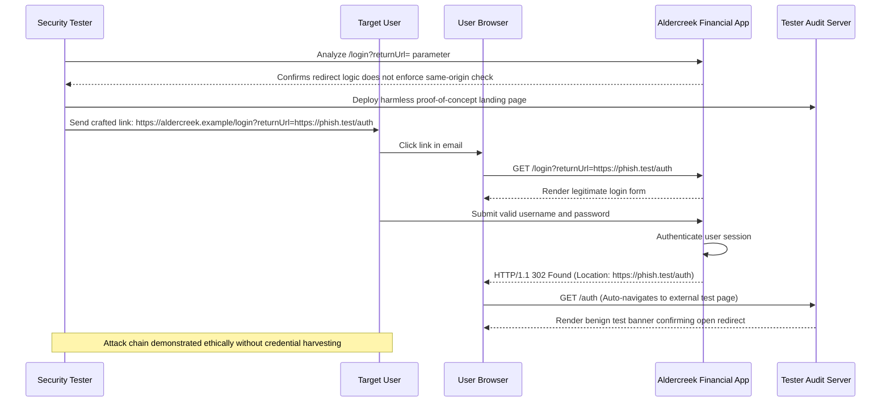

## Definition

An open redirect is a feature that sends a user's browser to a URL supplied through a request
parameter, without validating that the destination is safe or actually intended. It lets an
attacker craft a link that begins on a trusted, real domain but silently forwards the victim on to
an attacker-controlled site, with nothing in the visible link text giving that away.

## The Trust Boundary That Breaks

The application trusts that a "redirect to" or "return URL" parameter will only ever be used for
legitimate internal navigation, without ever restricting where it can actually point. The parameter
was almost certainly added to solve a small usability problem, sending a user back to whatever page
they were on before logging in, and nobody revisited it later to ask what happens if the value
points somewhere the application never intended.

## Where It Actually Shows Up

- **Post-login "return to where you were" redirects**, one of the most common places a raw,
  unvalidated destination parameter ends up.
- **Logout confirmation pages**, which frequently accept a "continue to" destination and receive far
  less security attention than a login flow does.
- **Marketing or email tracking-link redirectors**, whose entire purpose is forwarding to an
  external destination, making an overly permissive version of this pattern easy to overlook as
  "working as intended."

## Why It Keeps Happening

The impact looks small in isolation. It is, after all, "just a redirect," so it routinely gets
deprioritized against findings with an obviously bigger technical footprint. What is easy to
underestimate without seeing it demonstrated is the real value to an attacker: a phishing link that
visibly begins with a real, trusted domain is dramatically more convincing than one that does not,
and this flaw is precisely what makes that possible.

## How to Find It

1. Identify any parameter that controls where a user is sent after an action, a login, a logout, a
   tracked link, and test whether it accepts a fully external URL rather than only an internal path.
2. Confirm the browser actually navigates to the external destination, rather than being blocked,
   rewritten, or falling back to a default page.
3. Test common bypass variations of any partial protection found (a check for `http` at the start of
   the string, for example) using alternate URL formats, since naive string-based checks are
   routinely bypassed this way.

## Impact by Scenario

| Scenario | Realistic impact |
|---|---|
| Redirect parameter restricted to a fixed set of internal paths | Not exploitable as an open redirect |
| Open redirect present on a low-traffic internal tool with no public-facing use | Limited real-world impact; still worth fixing |
| Open redirect on a customer-facing login or logout flow | A materially more convincing phishing link, since it begins on the real, trusted domain |
| Open redirect combined with a token or credential passed in the same URL, exposed via the referrer of the final destination | Credential or session-token leakage to the attacker-controlled destination, on top of the phishing risk |

## Why a Business Should Care

An open redirect does not directly compromise data or access on its own, but it is one of the
cheapest, most effective tools an attacker has for making a phishing campaign against that specific
business's customers dramatically more convincing. The honest framing for a client is that this
finding's real cost shows up downstream, in a phishing campaign that is harder for their own
customers to spot precisely because the first, visible part of the link is genuinely real.

## A Worked Example

*(Generalized from real assessment patterns. Company and identifiers below are invented; no real
client, system, or data is referenced.)*

Aldercreek Financial Services' customer login page accepts a `returnUrl` parameter intended to send
a user back to the page they were viewing before being prompted to log in. During an authorized
assessment, setting that parameter to a fully external, clearly-labeled test domain results in the
browser navigating there directly after a successful login, with no warning shown to the user at
any point in the process.

A proof link is constructed that begins with Aldercreek's own real domain, exactly as a legitimate
company link would, and silently forwards to a controlled test page clearly marked as part of the
assessment. The proof of concept demonstrates the deception convincingly without hosting anything
actually harmful or collecting any real user's information.

## Severity Calibration

This instance rates **Medium** on its own: it does not directly expose data or grant unauthorized
access. Severity would increase specifically if demonstrated as a practical enabler of a more
convincing phishing campaign, or if combined with a sensitive token exposed through the destination
page's referrer header, either of which would move this toward a **High** rating; the open redirect
alone, without one of those compounding factors demonstrated, stays at Medium.

## Remediation

The real fix is restricting redirect destinations to a fixed allowlist of internal paths, or
explicitly validating that any supplied destination is same-origin before honoring it. Neither
approach requires trusting the raw string a user supplies.

The common bad fix is checking that the supplied URL "starts with http" or matches some partial
string pattern intended to look like the trusted domain. This is easily bypassed with alternate URL
formats and encodings, and treats the symptom of one specific attempted bypass rather than the
actual underlying gap.

## Related Classes

- **[Phishing](../../attacks/phishing/)**: an open redirect is one of the most direct, practical ways to strengthen a phishing
  campaign, since it lets a malicious link begin on a domain the victim already trusts.
