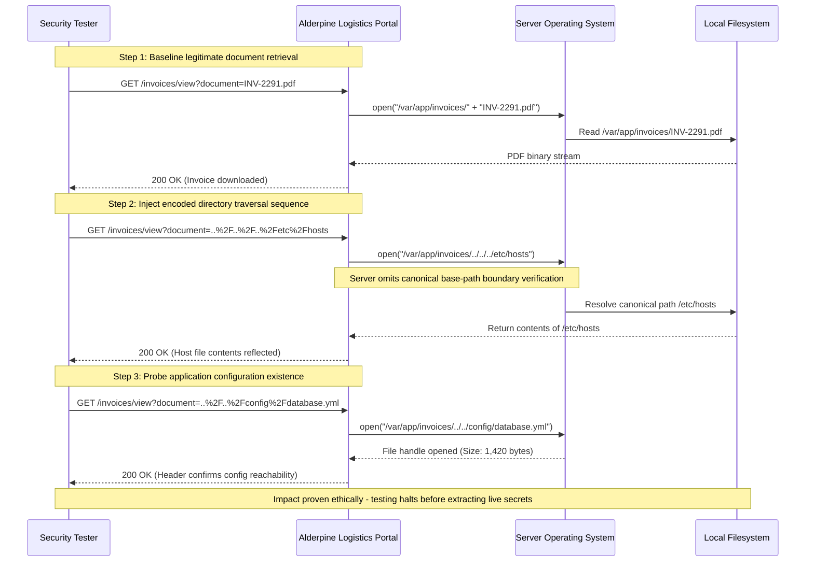

## Definition

Path traversal happens when an application reads or serves a file based on a path or filename an
attacker can influence, and that attacker supplies a crafted value, often using `../` sequences, that
resolves to a location far outside the folder the application ever intended to expose. Instead of
"the invoice the user asked for," the application ends up opening whatever file the crafted path
actually points to.

## The Trust Boundary That Breaks

The developer's assumption is usually: *this value is a filename, and filenames stay inside the
folder I put them in.* In reality, a filesystem path is not confined to a single folder just because
an application intends it to be. The operating system will happily resolve `../../../etc/hostname`
to wherever that sequence actually leads. The real trust boundary that has to hold is between "the
identifier a user supplies" and "the actual absolute path the server touches on disk," and that
boundary only exists if the server explicitly resolves the final path and checks it against an
allowed base directory before ever opening the file. Skipping that check means the boundary was never
enforced at all, only assumed.

## Where It Actually Shows Up

- File-download or file-preview features that take a filename directly as a parameter, such as
  `?file=invoice-104.pdf`, and pass it straight into a file-read call.
- Log-viewer or template-loading features that select a file by name from a request parameter.
- Static file servers or reverse-proxy configurations with incomplete or inconsistent path
  normalization, especially ones handling multiple encodings of the same path.
- Archive extraction features that write files using paths taken from inside an uploaded archive
  itself, which is the same underlying flaw applied to writing rather than reading.

## Why It Keeps Happening

Developers frequently validate that an input "looks like" a filename, no obviously suspicious
characters, rather than resolving the actual final path the server will touch and checking that
result against an allowed base directory. A blocklist approach that strips the literal string `../`
is easy to bypass with alternate encodings, and a fix applied to one file-serving endpoint often
isn't carried over to a newer, similar endpoint built later by someone unaware the first one needed
special handling at all.

## How to Find It

1. Identify any parameter that appears to select a file, a document name, a template, a log file, an
   image path, and test it with traversal sequences.
2. Test multiple encodings of the same sequence: the plain form, URL-encoded, and double-encoded,
   since naive filtering frequently catches only the plain, unencoded form.
3. Confirm the response actually contains content from outside the intended directory, not merely an
   error message that happens to look different. A genuinely different error alone is a signal worth
   following up, not a confirmed finding on its own.
4. If read access is confirmed, check separately whether the same code path (or a related upload or
   extraction feature) also allows writing to an attacker-chosen path, which is a meaningfully more
   severe variant of the same root cause.

## Impact by Scenario

| Scenario | Realistic impact |
|---|---|
| Traversal reaches a non-sensitive static asset outside the intended folder | Low to moderate: confirms the flaw, limited direct value on its own |
| Traversal reaches an application configuration file containing credentials or secrets | High: direct path to further compromise using the exposed credentials |
| Traversal reaches source code, exposing internal logic or other vulnerabilities | High: meaningfully aids further attacks beyond this one finding |
| A write-capable variant allows placing a file at an attacker-chosen path | Critical: can lead directly to remote code execution depending on where the write lands |

## Why a Business Should Care

Path traversal is one of the clearest examples of a flaw whose real-world impact depends entirely on
what happens to sit in the reachable directories, not on the technique's own sophistication, which is
low. A single missing check can expose a static image on one server and a full credentials file on
another. The useful framing for a client is that this class of bug rewards defense-in-depth: even if
one file-serving feature has this flaw, keeping sensitive configuration and credentials out of any
directory reachable this way, and running the application with least-privilege filesystem access,
limits how much a single traversal bug can actually reach.

## A Worked Example

*(Generalized from real assessment patterns. Company and identifiers below are invented; no real
system, client, or data is referenced.)*

Testing Alderpine Logistics' customer portal, a "view invoice" feature accepts a `document` parameter
that is passed directly into a file-read function: `GET /invoices/view?document=INV-2291.pdf`.
Supplying a URL-encoded traversal sequence in place of a normal filename returns the contents of a
file well outside the intended `invoices` directory, specifically a non-sensitive marker file placed
there deliberately for the test, confirming the read succeeds and resolves exactly where expected.

Following up, the same parameter is used to request the application's own configuration file. The
response confirms the file exists and is reachable, and its structure is consistent with containing a
database connection string. Testing stops at confirming reachability and structure; the actual
contents of that configuration file, including any credentials it holds, are not read out or used
further. That boundary is deliberate: proving the path is reachable is sufficient to establish
serious impact without actually extracting the secret itself.

## Severity Calibration

This instance rates **High**: unauthenticated, remotely exploitable, and demonstrated to reach a file
that plausibly holds live credentials, not merely a theoretical directory listing. It stops short of
Critical because the credentials themselves were never actually extracted or used to prove further
access; had that been demonstrated, the rating would move to Critical. The same underlying bug, found
in an application serving only non-sensitive static content from every reachable directory, would
rate substantially lower.

## Remediation

The real fix is resolving the requested path server-side to its canonical, fully-resolved absolute
form, then explicitly verifying that result still falls inside the allowed base directory before the
file is ever opened. An even stronger fix avoids taking a raw path from the user at all: map a
request to an internal identifier or database key instead of a filename, so there is no path for an
attacker to manipulate in the first place.

The common bad fix is blocklisting the literal string `../`, which is reliably bypassed by encoding
variations, double-encoding, or by using an absolute path directly. If the fix still involves parsing
and stripping specific substrings out of a user-supplied path, rather than resolving and validating
the final path, it isn't actually fixed.

## Related Classes

- [Broken Access Control](../broken-access-control/): a related failure at the access-control layer;
  path traversal is frequently one specific technique used to defeat access controls that were
  assumed, rather than enforced.
- [File Inclusion Vulnerabilities (LFI/RFI)](../file-inclusion/): a closely related class where the
  traversed path is not just read but actually executed as code by the application itself, a
  materially more severe variant of the same underlying trust failure.
