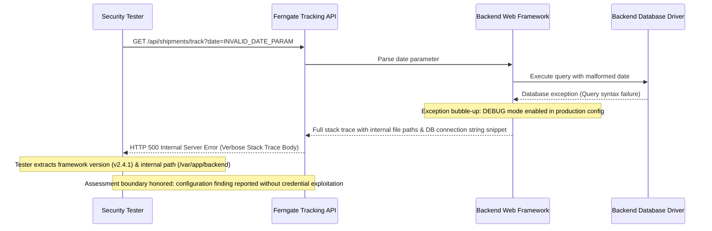

## Definition

Security misconfiguration is what happens when an application, server, or platform is insecure not
because of a flaw in its code, but because of how it was set up. A default credential never changed.
A debug feature left enabled in production. An error page that shows more than it should. None of
these require a clever exploit. They require an attacker to notice something the team meant to fix
later and never did.

## The Trust Boundary That Breaks

The assumption a team is usually making, often without ever stating it out loud, is that a
framework's or platform's default settings are "probably fine," and that anything genuinely unsafe in
a staging or development configuration (verbose error output, sample data, a debug endpoint) will
obviously get changed before the product reaches production. In practice, that handoff is rarely
enforced by anything more reliable than someone remembering to do it. The trust boundary that has to
hold is between "how this was configured for convenience during development" and "how this needs to
be configured for a system the public can reach." When nothing forces that transition to happen, it
often just doesn't.

## Where It Actually Shows Up

- Default administrative credentials shipped by a platform or vendor, never changed after
  installation.
- Directory listing left enabled on a web server, exposing the file structure of an application.
- Detailed stack traces and error pages returned to users in production, revealing internal file
  paths, library versions, and sometimes connection strings.
- Unnecessary HTTP methods, debug endpoints, or administrative interfaces left reachable from the
  public internet.
- Security headers (a Content Security Policy, for example) simply never configured, leaving
  browser-side protections that should have been enabled turned off by omission.

## Why It Keeps Happening

A configuration baseline gets hardened once, by hand, on one server, during a launch push. It's
rarely captured as a repeatable, automated process, so the next server provisioned, or the next
redeploy from a fresh image, quietly reverts to whatever the platform's insecure-by-default settings
happen to be. Staging and production environments also frequently share the same codebase and
configuration templates, and a setting that's genuinely useful in staging (verbose errors, for
example, make debugging much faster) is exactly the setting that shouldn't survive the trip to
production.

## How to Find It

1. Send a request designed to trigger an error (a malformed parameter, an unexpected content type)
   and check whether the response reveals more than a generic error message: a stack trace, a file
   path, a library version, or a database error string.
2. Check for default credentials on any administrative interface, management console, or vendor
   default account before assuming none exist.
3. Look for directory listing, exposed configuration files, or backup files left in a publicly
   reachable location, none of which require exploiting anything, just requesting the right path.
4. Compare the security headers an application actually returns against the standard, expected set
   for its type. A missing header is not exploitation, but it's the kind of gap this class is built
   from.

## Impact by Scenario

| Scenario | Realistic impact |
|---|---|
| Verbose error output reveals a library version with no other exposure | Reconnaissance value only: tells an attacker what to target next, not direct access on its own |
| Verbose error output reveals a database connection string or internal credential | Direct path to further compromise, since the leaked value is often reusable elsewhere |
| Default administrative credentials never changed on a reachable management interface | Full administrative access with no exploitation required at all |
| Directory listing exposes a forgotten backup file containing configuration secrets | Compromise of whatever those secrets protect, discovered purely by browsing |

## Why a Business Should Care

Security misconfiguration is the class where "we already have good developers" doesn't fully protect
a business, because the flaw usually isn't in code a developer wrote carefully. It's in a setting
nobody was specifically assigned to own. That distinction matters when explaining this to a client:
the fix here is process, not talent. A one-time hardening exercise before launch answers a question
that keeps changing (has anything drifted since then), and a business that only hardens once is
effectively hoping nothing changes for the life of the system.

## A Worked Example

*(Generalized from real assessment patterns. Company and identifiers below are invented; no real
system, client, or data is referenced.)*

Ferngate Logistics runs a customer-facing shipment tracking API. During testing, sending a request
with an intentionally malformed date parameter returns a full, unhandled stack trace rather than a
generic error response. The trace reveals the exact web framework version in use, an internal file
path showing the application's directory structure, and a fragment of a database connection string
visible in a logged exception message that was echoed back in the response body.

None of this required guessing a password or exploiting a coding flaw. Sending one deliberately bad
request and reading the response was the entire technique. The framework version alone is enough to
check against known, publicly disclosed vulnerabilities for that specific version; the connection
string fragment, even partial, materially narrows what a follow-up attack would need to guess.

Testing stops at confirming the exposure and what it reveals. No attempt is made to use the partial
connection string to actually reach the database; demonstrating that the information is exposed is
sufficient to prove the finding without going further than necessary.

## Severity Calibration

This instance rates **High**: unauthenticated, requires no special access, and demonstrably exposes
internal implementation detail (framework version, file paths, a credential fragment) that
meaningfully accelerates a follow-up attack. It does not rate Critical on its own, because the
misconfiguration itself is a disclosure, not direct unauthorized access; severity would move to
Critical only if the exposed detail were shown to grant real access, which testing deliberately did
not pursue further than confirming the exposure.

## Remediation

The real fix is a locked-down, version-controlled configuration baseline applied consistently to
every environment and re-verified on every deployment, not just set once by hand at launch: disable
verbose error output in production specifically, remove default accounts and sample content before
go-live, and disable directory listing and unused administrative interfaces by default.

The common bad fix is manually hardening a single server after the fact, with no repeatable process
behind it. The very next redeploy, or the next server added to the fleet, silently reverts to the
platform's own insecure default, and nobody notices until it's found again, this time possibly by
someone without authorization to be looking.

## Related Classes

- **[Vulnerable and Outdated Components](../vulnerable-outdated-components/)**, a closely related failure mode where the insecure element
  isn't a setting but an entire piece of software nobody kept current.
- **[Broken Access Control](../broken-access-control/)**, since a misconfigured administrative
  interface often becomes an access control failure the moment it's actually reachable by someone
  who shouldn't be able to reach it.
- **[Public Cloud Storage Exposure](../cloud-storage-exposure/)**: the
  single highest-frequency real-world instance of this class, a permissive default left unreviewed on
  a cloud storage resource specifically.
