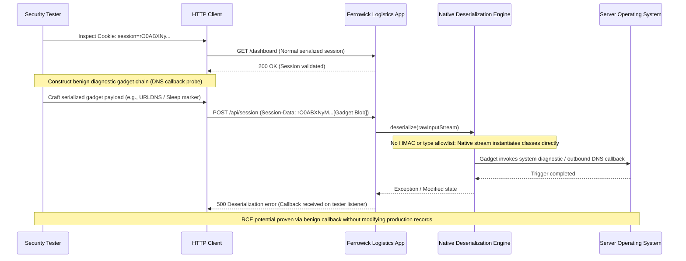

## Definition

Software and data integrity failures happen when an application trusts that a piece of software,
an update, or a chunk of data is what it claims to be, without actually verifying that it hasn't
been tampered with. The failure isn't in what the data contains. It's in the missing check that
would have confirmed the data's origin and integrity before the application acted on it.

## The Trust Boundary That Breaks

Applications routinely trust things based on where they arrived from rather than verifying what
they actually are: a serialized object handed back by the client, a build artifact produced by a
CI/CD pipeline, an update package delivered through an auto-update mechanism. The assumption is that
because something came through the expected channel, it must be legitimate. That assumption breaks
the moment an attacker can insert or alter data anywhere along that channel: a crafted serialized
object, a compromised build step, or a tampered update package all look, from the application's
point of view, exactly like the real thing.

## Where It Actually Shows Up

- **Insecure deserialization**: an application deserializes a user-supplied serialized object
  without validating its structure or origin. A crafted payload using a known gadget chain pattern
  for that serialization format executes during the deserialization process itself, before any
  application logic runs.
- **CI/CD pipelines with no integrity verification** on build artifacts, so a compromised build step
  anywhere in the chain can insert malicious code that ships to production looking identical to a
  legitimate release.
- **Auto-update mechanisms** that install whatever they're served without verifying a cryptographic
  signature, trusting the delivery channel instead of the content itself.

## Why It Keeps Happening

Native serialization formats in many languages and frameworks are convenient: pass an object across
a boundary, and the framework handles converting it back automatically. That convenience is exactly
the problem. The deserialization process itself can be made to construct objects and invoke code as
a side effect of simply reading the data, which most developers don't realize happens before their
own application logic ever gets a chance to validate anything. CI/CD integrity checks, similarly, are
often skipped because a pipeline "worked" without them, and nobody revisits that decision until
something goes wrong.

## How to Find It

1. Identify every place an application deserializes data it didn't generate itself: session objects,
   cached data, message queue payloads, anything passed back from a client or a third party.
2. Test whether the deserialization process validates structure and origin before trusting the
   result, or whether it deserializes first and only inspects the outcome afterward.
3. Review CI/CD pipeline configuration for whether build artifacts are signed and that signature is
   actually verified before deployment, not just present as an unused feature.
4. Check auto-update mechanisms specifically for signature verification before installing anything
   delivered through them.

## Impact by Scenario

| Scenario | Realistic impact |
|---|---|
| Deserialization of untrusted data with no structural validation | Remote code execution during the deserialization process itself, often before authentication even applies |
| CI/CD pipeline with unsigned or unverified build artifacts | A single compromised build step can insert malicious code into every downstream deployment |
| Auto-update mechanism with no signature verification | An attacker who can intercept or redirect the update channel can push arbitrary code to every installed instance |

## Why a Business Should Care

This category is dangerous precisely because it bypasses the controls a business usually points to
when explaining its security posture. Strong authentication, careful input validation on forms, and
a well-configured firewall all sit downstream of the point where a deserialization exploit or a
compromised build artifact actually executes. A client asking "are we protected against this" needs
a different answer than the one that covers most of the rest of this site: not "do we validate
input," but "do we verify that anything we trust based on its origin actually is what it claims to
be."

## A Worked Example

*(Generalized from real assessment patterns. Company and identifiers below are invented; no real
system, client, or data is referenced.)*

Ferrowick Logistics runs an internal scheduling application that accepts a serialized session object
from the client on each request, restoring session state directly from it. During an assessment, a
crafted payload built around a known, publicly documented gadget chain for that serialization format
is submitted in place of a normal session object. The application deserializes it without validating
structure or origin, and the payload triggers unexpected behavior consistent with code execution
during the deserialization process itself.

Testing stops at confirming that the crafted payload changes application behavior in a way only
explainable by execution during deserialization, using a non-destructive marker rather than any
payload designed to persist or spread. No production data is touched, and no further access is
pursued beyond what's needed to prove the flaw is real.

## Severity Calibration

This class typically rates at the high end because the exploit executes before most application-level
controls (authentication checks, authorization logic) ever run. The specific severity still depends
on what the deserializing process has permission to do on the host: a process running with broad
system privileges turns this into a full compromise, while a tightly sandboxed process limits the
practical blast radius even when the underlying flaw is identical.

## Remediation

The real fix is avoiding native deserialization of untrusted data entirely in favor of simple,
schema-validated data formats with no executable structure, such as JSON validated against a strict
schema. Where serialization of complex objects is unavoidable, cryptographically sign the data and
verify that signature before deserializing, not after. The common bad fix is deserializing first and
only checking or "sanitizing" the resulting object afterward: by that point, the exploit has already
executed during the deserialization process itself, and any check on the result runs too late to
matter.

## Related Classes

- **[Supply Chain Attack](../../attacks/supply-chain-attack/)**
  is the closest attack-technique parallel: both exploit the same "trusted because of where it came
  from" assumption, just at different points in the software lifecycle.
