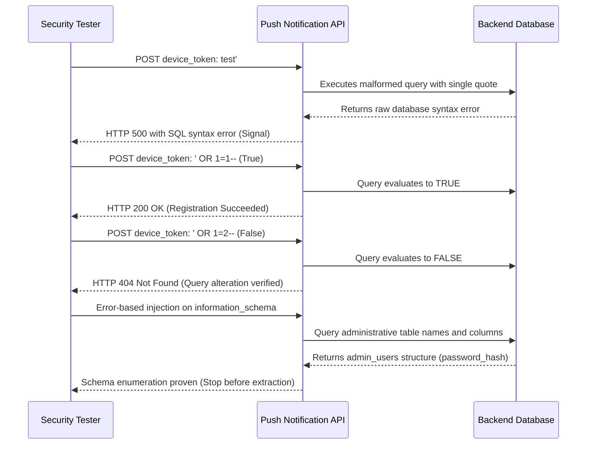

## Definition

SQL injection happens when a value that came from outside the application (a request parameter, a
form field, a header) gets concatenated directly into a SQL query string instead of being passed to
the database as data. Once that happens, the database can no longer tell the difference between "a
value the query should compare against" and "a piece of SQL syntax the attacker wants executed." The
attacker isn't giving the application bad data; they're giving it a different query.

## The Trust Boundary That Breaks

The developer's trust assumption is almost always some version of: *this field can't contain anything
meaningful, so it's safe to treat as an inert string.* A device token, a registration ID, or a numeric-
looking parameter gets treated as an opaque value with no structure worth validating, which
quietly becomes "no structure worth *escaping*" either.

The actual trust boundary that has to hold is the line between the application layer and the database
layer: everything that crosses it should arrive as a bound parameter, never as text spliced into a
query string. When a developer skips that step, usually because the field "obviously" can't contain
anything dangerous, the boundary simply isn't there anymore. The database has no way to enforce a
distinction the application never drew in the first place.

## Where It Actually Shows Up

- Request fields fed into a raw, string-built query (`"...WHERE id = '" + input + "'"`) instead of a
  parameterized query or an ORM's safe query-builder API.
- **Especially** in fields that look structurally meaningless (device tokens, session identifiers,
  registration IDs), precisely because they read as "not user input that needs validating" to whoever
  wrote the handler.
- Endpoints that share a query-building helper function with several sibling routes. If one endpoint
  using that helper is vulnerable, the others usually are too; just as often, one sibling turns
  out to filter dangerous keywords while another, newer or less-reviewed endpoint using the same
  underlying table doesn't filter at all.
- Legacy handlers sitting next to newer, correctly parameterized code in the same codebase. SQL
  injection is rarely "the whole application is unsafe": it's usually one or two handlers that were
  written differently, often under time pressure, from everything around them.

## Why It Keeps Happening

- A safe parameterization pattern exists and is used correctly elsewhere in the same codebase, but a
  newer or rushed endpoint reverts to manual string-building because it "just needed to work."
- A value that's shaped like a token or ID (hex string, UUID-like) gets *assumed* safe because of its
  shape, without anything actually validating or enforcing that shape server-side.
- Query-building code that was originally fine for a hardcoded, developer-controlled value gets
  adapted later to accept a variable, without anyone adding parameter binding at the same time.
- The framework's default query path is safe, but a raw/manual escape hatch exists for edge cases, and
  someone reaches for it under deadline pressure without threat-modeling what "raw" actually means.

## How to Find It

1. Send a value that would break query syntax if concatenated raw (a single quote is the standard
   first probe) and watch for a database error, a change in response shape, or a timing change
   against a clean baseline.
2. Never stop at one anomalous response. Pair it with a **boolean-based differential**: send two
   otherwise-identical requests, one payload that resolves to an always-true condition and one that
   resolves to always-false, against the same field. If the responses genuinely differ and do so
   consistently, that's a real signal. A single odd response with no control pair is an *oracle*, not
   a confirmed finding; say so, don't overclaim it.
3. On the code side, grep for raw query-construction (string concatenation or interpolation into a
   query call) rather than the parameterized or query-builder API the rest of the codebase uses: the
   inconsistency itself is often the fastest way to find the vulnerable handler.
4. Once one field on an endpoint is confirmed injectable, test every *other* field on that same
   endpoint independently. Filtering is very often applied per-field, not per-endpoint: a blocked
   field next to an unfiltered one on the same route is a common, real pattern, not an edge case.

## Impact by Scenario

| Scenario | Realistic impact |
|---|---|
| Database account is scoped to the application's own schema only | Read/write limited to that app's own data; still serious, but bounded to what the app itself holds |
| Database account is shared across multiple applications or databases (a common legacy "one master credential" shortcut) | The injection point in one minor feature becomes a pivot into every database that shared account can reach: blast radius is set by the credential's privileges, not the vulnerable feature's own scope |
| `information_schema` / system catalog access isn't filtered | Full schema enumeration without guessing: every table and column name, often enough on its own to prove a real admin-credential table is reachable |
| Stacked queries or command-execution-capable database functions are actually available | A path toward write access or further platform compromise beyond simple reads, but this must be verified directly, never assumed from the vulnerability class alone |
| A managed/cloud database platform blocks file I/O and command-execution UDFs at the platform level | A real structural ceiling exists below remote code execution even with full query control: confirm this with direct, safe testing rather than taking it on faith either way |

## Why a Business Should Care

For a business, SQL injection is rarely framed correctly as "the database got attacked." It's more
precisely one of the most efficient paths to a very specific, expensive outcome: a real,
regulated-data breach. It routinely means direct exfiltration of exactly the tables that data-
protection law cares about (customer PII, payment tokens, credential stores), not an abstract
"system compromise." That's why this class carries incident-response cost, breach-notification
obligations, and regulatory exposure (GDPR, India's DPDP Act, HIPAA, PCI-DSS, depending on what's
stored) almost automatically the moment exfiltration is demonstrated, in a way a defaced page or a
denial-of-service simply doesn't. When you're the one explaining this to a client: SQL injection is
the finding class where "we haven't been breached yet" does the least work to reassure anyone, because
the barrier to entry (one unparameterized query, one overlooked field) is genuinely that low.

## A Worked Example

*(Generalized from real engagement patterns. Company, product, and identifiers below are invented;
no real system, client, or data is referenced.)*

Northlight Media runs a mobile push-notification API. Ordinary requests to its device-registration
endpoint, `POST /api/notifications/register-device`, behave normally. Sending a `device_token` value
containing a single quote returns a raw database error in the response body: the first signal, not
yet proof of anything exploitable.

Following up with two otherwise-identical requests, one payload that resolves to an always-true
condition and one to always-false, produces two consistently different response shapes. That's the
real confirmation: the application's actual query logic is being altered, not just its error output.

Extending the payload with an error-based extraction technique returns the live database name directly
in the error message. From there, querying `information_schema.tables` (unfiltered on this specific
endpoint, unlike a sibling endpoint on the same API that blocks references to system schemas) enumerates
the complete table list, including one whose name and column shape match an administrative credential
store. Enumerating that table's columns confirms a password-hash field exists; a row count confirms
it's a live, populated table, not a decommissioned artifact.

Testing stops there. Table existence, column structure, and row count are sufficient to prove the
access is real and serious: no actual credential value is ever read out of the table. That boundary
is deliberate: it's the difference between proving exploitability and holding data nobody authorized
you to hold.

## Severity Calibration

This instance rates **Critical**: unauthenticated, remotely exploitable, and, the part that actually
matters, demonstrated, not theoretical, access to a real admin-credential store specifically, not an
incidental low-value table. Notice what's actually doing the work in that rating: it isn't "SQL
injection exists." A vulnerability class never sets severity by itself. It's the combination of no
authentication required, a genuine trust boundary crossed (anonymous internet request straight through
to the database layer), and a demonstrated blast radius that reaches credential data. The identical
code-level bug, found in a field that turned out to only reach an empty, decommissioned table, would
rate meaningfully lower. The class doesn't set severity; the evidence does.

## Remediation

The real fix is parameterized queries or prepared statements (or a framework's safe query-builder
API) everywhere a request-derived value ever reaches a SQL string, with no exceptions carved out for
fields that "look" safe. Cast anything that's supposed to be numeric to an actual numeric type before
use, as defense-in-depth on top of parameterization, not instead of it.

The common bad fix is string-escaping or keyword-blocklisting: stripping quotes, blocking the literal
word `SELECT`. This is trivially bypassable (alternate encodings, case variation, comment-based
obfuscation) and treats a symptom instead of the actual root cause: untrusted data reaching raw query
construction in the first place. If the fix still involves building a query string by hand, it isn't
actually fixed.

## Related Classes

- **[Broken Access Control](../broken-access-control/)**: once an attacker is inside a database via
  injection, what they can *do* with what they find often comes down to how access control is
  enforced everywhere else in the system.
- **[Server-Side Request Forgery](../ssrf/)**, a structurally different class but frequently found on
  the same target, often traces back to the same root cause: trusting an input because of where it's
  used rather than validating what it actually is.
- **[OS Command Injection](../command-injection/)**: the same root cause, data crossing into code, at
  a different execution layer, the shell instead of the database.
- **[Cross-Site Scripting](../cross-site-scripting/)**: the injection-family sibling most often
  confused with this class, despite executing somewhere completely different, the victim's browser,
  not the server's database.
