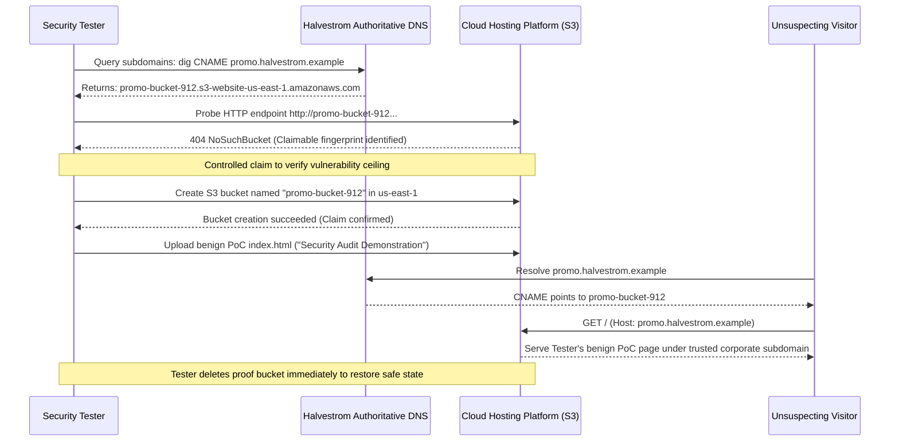

## Definition

Subdomain takeover happens when a DNS record, commonly a CNAME, still points a subdomain at a
third-party or cloud-hosted resource that has since been deleted or deprovisioned, while the DNS
record itself was never removed. Anyone can then claim that same resource name on the provider's
side, and the organization's own trusted subdomain starts serving the attacker's content instead.

## The Trust Boundary That Breaks

The organization trusts that a DNS record pointing at a cloud resource stays accurate for as long
as the record itself exists. In practice, cloud resources get decommissioned constantly: a test
environment gets torn down, a marketing microsite gets retired, a proof-of-concept gets deleted once
the project ends. DNS cleanup is a separate, manual step, owned by a different process or a
different person than the one who deleted the resource, and it is the step that gets forgotten.

## Where It Actually Shows Up

- Forgotten CNAME records left behind from a retired marketing campaign microsite.
- A decommissioned staging or QA environment whose DNS entry was never cleaned up.
- An unused cloud storage bucket or app-hosting endpoint reference that outlived the resource it
  pointed to. See [Cloud Security](../../domains/cloud-security/) for the underlying resource
  lifecycle discipline this connects to.

## Why It Keeps Happening

Decommissioning a cloud resource and cleaning up the DNS record that points at it are usually two
separate manual steps, often owned by different people or teams entirely. The person deleting the
resource is not always the person who set up the DNS record, and once the resource itself is gone
and out of mind, the record referencing it is too.

## How to Find It

1. Enumerate an organization's subdomains and their DNS records.
2. Check whether any CNAME points at a cloud-provider resource name that currently appears unclaimed
   or available: many cloud platforms expose a fingerprint (a specific error page or response) when
   a referenced resource does not exist.
3. Confirm the record is genuinely stale, not just pointed at a resource that is temporarily
   unreachable, before attempting anything further.
4. If claiming the resource to prove the finding, use a disposable, clearly-labeled resource of your
   own, and release it immediately once the point is proven.

## Impact by Scenario

| Scenario | Realistic impact |
|---|---|
| Stale record points at a resource type with no real content-hosting capability | Low impact; little for an attacker to actually do with it |
| Stale record can host arbitrary attacker content under the organization's trusted subdomain | High impact; convincing phishing or malware distribution from a trusted-looking address |
| Stale subdomain is also used for cookie-setting or authentication-adjacent purposes | Most severe; the takeover can reach session or authentication data scoped to that domain |

## Why a Business Should Care

A subdomain takeover turns an organization's own trusted domain name into infrastructure for
someone else's phishing page or malware distribution, and the visible damage is entirely
reputational: the address in the browser bar is genuinely theirs. It costs nothing to prevent, a
single cleanup step, but it is the kind of gap that only surfaces after something has actively
outgrown the team's attention.

## A Worked Example

*(Generalized from real assessment patterns. Company and identifiers below are invented; no real
system or data is referenced.)*

While auditing Halvestrom Media's DNS records, a CNAME entry under a subdomain is found pointing at
a cloud-hosted resource name that returns the platform's own "resource not found" fingerprint,
indicating the referenced resource no longer exists. A disposable test resource is registered under
the tester's own control using that exact name, successfully claiming it. A brief, clearly-labeled
proof page is published there to confirm the subdomain now resolves to tester-controlled content,
then the claimed resource is released immediately afterward.

## Severity Calibration

Severity depends on what the subdomain is actually used for and what an attacker-controlled page
there could realistically reach, not on the misconfiguration itself. A stale record pointing at a
resource type with minimal capability rates lower than one on a subdomain still referenced by other
systems or capable of setting cookies scoped more broadly than expected.

## Remediation

The real fix is removing the DNS record as part of the same decommissioning process that tears down
the underlying resource, treating the two as one atomic step rather than two separately-owned ones,
plus a periodic audit of all DNS records against what is actually still provisioned.

The common bad fix is leaving the record in place "in case it's needed again." That exact habit is
what creates the exposure: the record outlives the resource, and outliving it is the entire
vulnerability.

## Related Classes

- **[Security Misconfiguration](../security-misconfiguration/)**:
  the broader category this class falls under, an environment left in an insecure state through
  neglect rather than a coding flaw.
