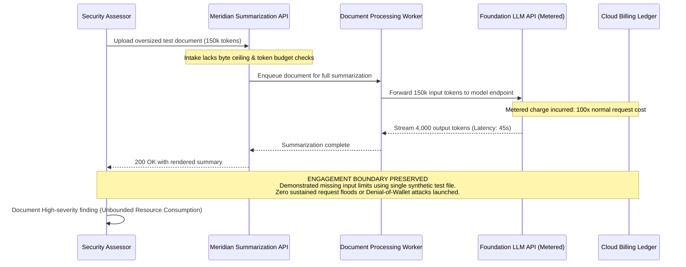

## Definition

Unbounded consumption happens when an AI system has no effective limit on how much computation,
context length, or metered cost a single request, user, or automated loop can drive. Because
inference is typically billed by usage (tokens processed, compute time, API calls), a system with no
ceiling on this doesn't just risk running slowly under load the way a traditional application does; it
risks direct, uncapped financial cost, alongside the more familiar availability impact of any other
resource-exhaustion issue.

## The Trust Boundary That Breaks

A team building an AI feature typically sizes it around expected, well-behaved usage: a reasonable
question, a reasonable-length document to summarize, a bounded number of steps in an automated
workflow. The system trusts that real usage will stay roughly proportional to that expectation. That
assumption breaks the moment a single crafted request, an extremely long input, a deliberately
repetitive prompt designed to maximize output length, or an agent stuck in an unproductive loop, can
consume resources wildly disproportionate to what a normal, well-intentioned request would. Nothing
about the request has to look malformed for this to happen; it just has to be large or repetitive in a
way nothing in the system was built to cap.

## Where It Actually Shows Up

- No limit on input or output length for a single request, letting one oversized request consume far
  more processing time and cost than the feature's typical use case was ever sized for.
- An autonomous agent caught in a retry or reasoning loop, repeatedly calling an expensive tool or
  the model itself with no maximum step count or timeout, especially relevant wherever [Excessive
  Agency](../excessive-agency/) has already granted an agent broad, chained tool access.
- No per-user or per-API-key rate limiting or usage quota on a feature billed per token or per
  request, letting a single compromised account, or a single malicious or careless script, drive
  significant unexpected cost before anyone notices.
- Repeated, high-volume querying used to systematically probe and approximate a proprietary model's
  behavior, an extraction technique that depends specifically on the absence of any limit on how many
  queries a single caller can make.

## Why It Keeps Happening

Teams building an AI feature typically focus first on getting it working correctly, with cost and
resource governance treated as an operational concern to add later, if at all. Metered, per-token
billing for inference is also a genuinely new category of operational risk for many teams: the
muscle-memory habit of setting rate limits and quotas that's long been standard for traditional APIs
hasn't yet become the default reflex for AI features, and the financial exposure from an uncapped
feature is easy to underestimate until an actual usage spike makes it concrete.

## How to Find It

1. Test with a deliberately oversized input (an unusually long document, an extremely long
   conversation) and measure whether the system enforces any length limit or degrades gracefully,
   rather than processing it in full regardless of size.
2. For any agentic or multi-step workflow, test whether a scenario designed to be unproductive (an
   ambiguous task with no clear resolution) causes the agent to loop indefinitely or terminate after a
   bounded number of steps.
3. Review whether rate limiting and per-user or per-key quotas actually exist at the API layer, and if
   so, whether they're scoped tightly enough to meaningfully cap a single caller's worst-case cost.
4. Where a genuine resource-consumption issue is confirmed, measure it at a scale sufficient to prove
   the missing limit (a handful of oversized test requests) rather than actually driving a large-scale
   cost or availability impact against a live system.

## Impact by Scenario

| Scenario | Realistic impact |
|---|---|
| Occasional large legitimate requests cause a minor, bounded cost increase | Low; a capacity-planning issue rather than a security one |
| No per-request limit exists, but typical usage patterns keep actual cost impact modest | Medium; a real, unaddressed exposure without demonstrated large-scale impact |
| A single crafted request or account can drive materially disproportionate cost or processing time | High; a demonstrated, exploitable resource-exhaustion path |
| Sustained abuse or an unbounded agent loop is capable of significant, ongoing cost or availability impact | Critical; a real denial-of-service and denial-of-wallet risk |

## Why a Business Should Care

This is one of the more concrete, easy-to-quantify AI risk categories to raise with a client, because
the consequence is a number on an invoice, not an abstract security concept: metered inference cost
with no ceiling is a direct, uncapped financial exposure, on top of the more familiar availability risk
any resource-exhaustion issue carries. A useful question for a client to ask about any AI feature
before it ships: what is the worst-case cost of a single request, and what actually stops someone,
maliciously or just carelessly, from triggering that worst case repeatedly.

## A Worked Example

*(Generalized from real assessment patterns. Company and identifiers below are invented; no real
system or data is referenced.)*

Meridian Health Analytics' document-summarization feature accepts an uploaded file with no explicit
size or length limit enforced before processing. Submitting a single test document deliberately sized
well beyond the feature's typical expected input, created specifically for this assessment, causes
processing time and token consumption several times higher than a normal document of expected length,
confirming no length-based limit or graceful degradation exists at the intake point.

Testing is limited to submitting a small number of oversized test documents sufficient to confirm the
missing limit and measure the disproportionate resource consumption. No attempt is made to submit a
volume of requests large enough to cause an actual availability or cost impact against the live
system.

## Severity Calibration

This rates **High** because the finding demonstrates a clearly exploitable, disproportionate
resource-consumption path reachable by a single request with no authentication barrier beyond normal
feature access; a confirmed, sustained abuse scenario capable of large-scale cost or availability
impact would justify a Critical rating instead. Severity for this class tracks how easily a
disproportionate impact can actually be triggered and how large that impact could realistically become,
not merely the absence of an explicit limit in the abstract.

## Remediation

The real fix is enforcing limits at multiple layers: input and output length caps sized to the
feature's actual legitimate use case, timeouts and maximum step counts for any agentic or multi-step
workflow, and per-user or per-key rate limiting and usage quotas at the API layer, paired with
monitoring and alerting on unusual usage spikes so an issue is caught quickly rather than discovered
on a bill weeks later.

The common bad fix is relying solely on the AI provider's own account-level billing cap as the safety
net. That limits the absolute worst case eventually, but does nothing to stop a single user or attacker
from degrading availability or driving significant cost well before that account-wide cap is ever
reached.

## Related Classes

- **[Excessive Agency](../excessive-agency/)**: the mechanism that most often
  turns unbounded consumption into a serious issue, when an agent with broad, chained tool access has
  no step limit on how far a single manipulated or unproductive task can run.
